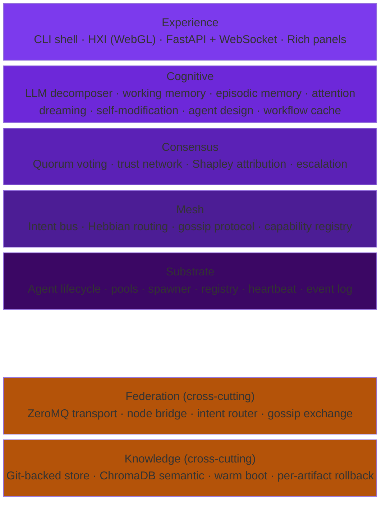
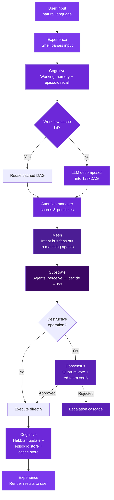
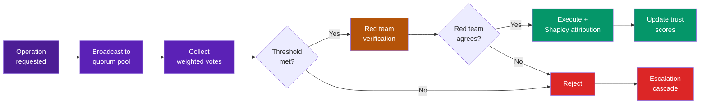

# Architecture Overview

ProbOS is built as seven layers, each built on the one below, plus two cross-cutting concerns:

## Layer Responsibilities

Each layer has a single, clear purpose:

| Layer | Responsibility |
|-------|---------------|
| [**Substrate**](substrate.md) | Agent lifecycle — birth, health, death, recycling |
| [**Mesh**](mesh.md) | Agent coordination — discovery, routing, communication |
| [**Consensus**](consensus.md) | Safety — multi-agent agreement before destructive actions |
| [**Cognitive**](cognitive.md) | Intelligence — NL understanding, memory, learning, self-modification |
| [**Experience**](experience.md) | Interface — shell, visualization, API |
| [**Federation**](federation.md) | Scale — multi-node mesh of meshes |
| [**Knowledge**](knowledge.md) | Persistence — durable storage with semantic search |

## Request Flow

A typical request flows through the stack:

## Consensus Pipeline

Destructive operations go through a multi-step safety pipeline:

## Crew Organization

Agents are organized into specialized teams, analogous to departments on a starship. Each team is an agent pool with a distinct responsibility:

| Team | Function | Key Agents |
|------|----------|------------|
| **Medical** | Health monitoring, diagnosis, remediation | Vitals Monitor, Diagnostician, Surgeon, Pharmacist, Pathologist |
| **Engineering** | Performance optimization, maintenance, builds | Performance Monitor, Maintenance Agent, Builder Agent |
| **Science** | Research, discovery, architectural analysis | Research Agent, Architect Agent |
| **Security** | Threat detection, defense, trust integrity | Threat Detector, Trust Integrity Monitor, Red Team Lead |
| **Operations** | Resource management, scheduling, coordination | Resource Allocator, Scheduler, PoolScaler |
| **Communications** | Channel adapters, federation, external interfaces | Discord Adapter, Slack Adapter, Federation Bridge |
| **Bridge** | Strategic decisions, human approval gate | Introspection Agent, Human Approval Gate |

The **Ship's Computer** provides shared infrastructure across all teams: the Intent Bus (intercom), Trust Network (crew records), Hebbian Router (navigation), Episodic Memory (ship's log), and CodebaseIndex (technical manual).

Each ProbOS instance is a ship. Multiple instances form a [Federation](federation.md). See the [Roadmap](../development/roadmap.md) for the full crew structure and build phases.

## Design Principles

1. **Agents all the way down.** There is no central controller. Every capability is an agent.
2. **Probabilistic over deterministic.** Confidence scores, Bayesian trust, weighted voting.
3. **Self-organizing.** Hebbian learning routes intents to the best agents without configuration.
4. **Self-healing.** Degraded agents are recycled. Pools scale to demand.
5. **Self-modifying.** Capability gaps trigger the design of new agents at runtime.
6. **Transparent.** Every decision can be explained via introspection commands.
