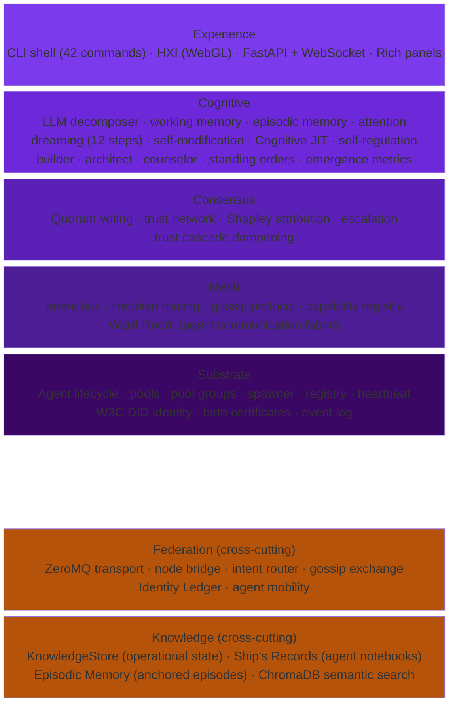
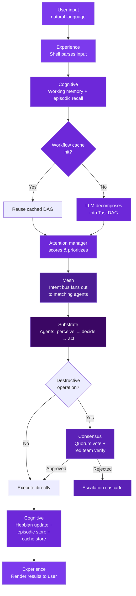
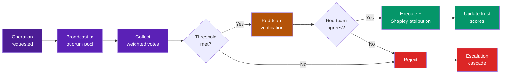

# Architecture Overview

ProbOS is built as seven layers, each built on the one below, plus two cross-cutting concerns:

## Layer Responsibilities

Each layer has a single, clear purpose:

| Layer | Responsibility |
|-------|---------------|
| [**Substrate**](substrate.md) | Agent lifecycle — birth, health, death, recycling |
| [**Mesh**](mesh.md) | Agent coordination — discovery, routing, communication |
| [**Consensus**](consensus.md) | Safety — multi-agent agreement before destructive actions |
| [**Cognitive**](cognitive.md) | Intelligence — NL understanding, memory, learning, self-modification, procedural learning |
| [**Experience**](experience.md) | Interface — shell, visualization, API |
| [**Memory**](memory.md) | Episodic memory — anchored episodes, salience-weighted recall, dream consolidation |
| [**Federation**](federation.md) | Scale — multi-node mesh of meshes, DID identity |
| [**Knowledge**](knowledge.md) | Persistence — operational state, Ship's Records, semantic search |

## Request Flow

A typical request flows through the stack:

## Consensus Pipeline

Destructive operations go through a multi-step safety pipeline:

## Crew Organization

Agents are organized into 6 departments (PoolGroups), analogous to departments on a starship:

| Department | Chief | Function | Key Agents |
|------------|-------|----------|------------|
| **Medical** | Bones | Health monitoring, diagnosis, remediation | Diagnostician, VitalsMonitor, Surgeon, Pharmacist, Pathologist |
| **Engineering** | LaForge | System architecture, code generation, build pipeline | EngineeringAgent, BuilderAgent, CodeReviewAgent |
| **Science** | Number One | Research, analysis, codebase knowledge | DataAnalyst (Kira), SystemsAnalyst (Lynx), ResearchSpecialist (Atlas), Scout (Horizon) |
| **Security** | Worf | Threat detection, trust integrity | SecurityAgent |
| **Operations** | O'Brien | Resource management, scheduling, watch rotation | OperationsAgent |
| **Bridge** | — | Strategic decisions, human approval, cognitive wellness | Captain (Human), Architect (Meridian), Counselor (Echo) |

Agents communicate through the **Ward Room** — department channels, cross-department threads, 1:1 DMs, and All Hands broadcasts.

The **Ship's Computer** provides shared infrastructure: Intent Bus (intercom), Trust Network (crew records), Hebbian Router (navigation), Episodic Memory (ship's log), Ward Room (communication fabric), CodebaseIndex (technical manual), Standing Orders (constitution), Structural Integrity Field (invariant enforcement), KnowledgeStore (operational state), Ship's Records (agent notebooks, duty logs, Captain's Log).

Each ProbOS instance is a ship. Multiple instances form a [Federation](federation.md). See the [Roadmap](../development/roadmap.md) for the full crew structure and build phases.

## Design Principles

1. **Agents all the way down.** There is no central controller. Every capability is an agent.
2. **Probabilistic over deterministic.** Confidence scores, Bayesian trust, weighted voting.
3. **Self-organizing.** Hebbian learning routes intents to the best agents without configuration.
4. **Self-healing.** Degraded agents are recycled. Pools scale to demand.
5. **Self-modifying.** Capability gaps trigger the design of new agents at runtime.
6. **Transparent.** Every decision can be explained via introspection commands.
