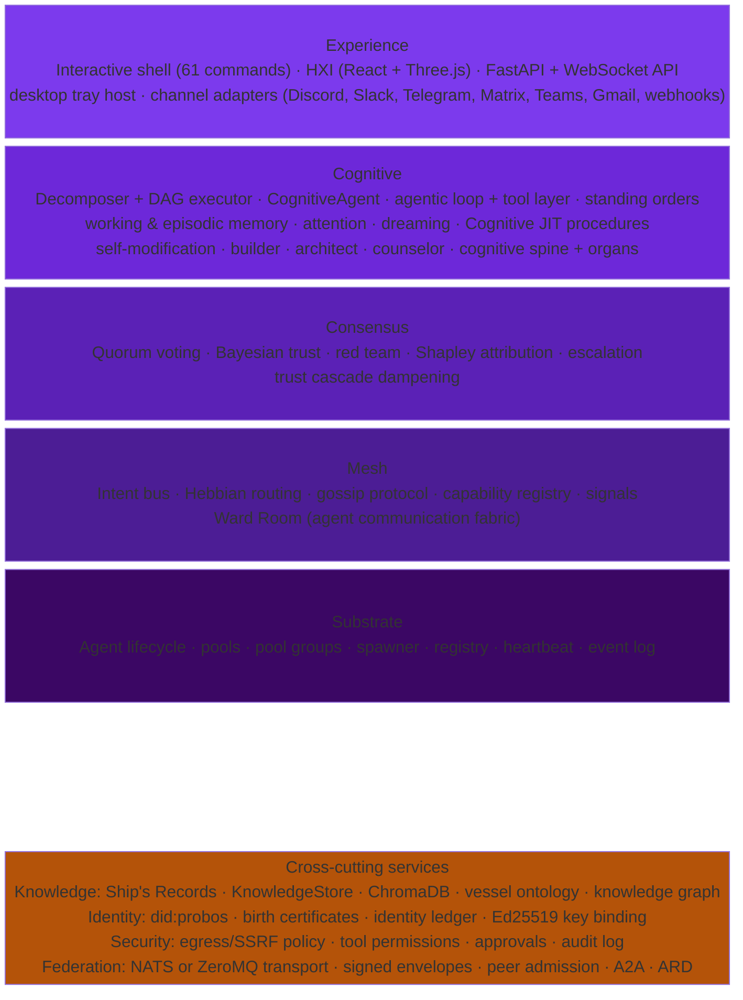
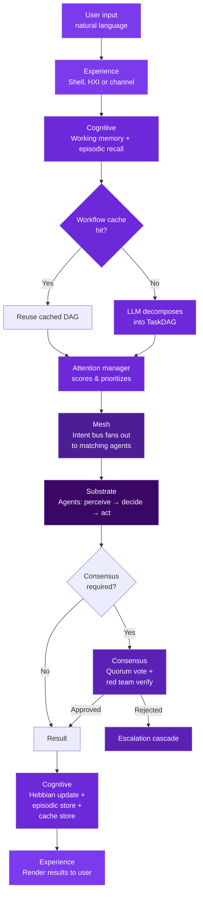
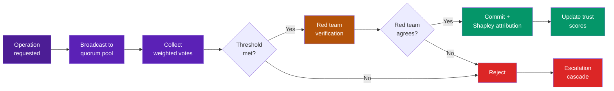

# Architecture Overview

ProbOS is built as five layers, each built on the one below, plus cross-cutting services for knowledge, identity, security and federation:

```mermaid
block-beta
    columns 1
    Experience["Experience\nInteractive shell (61 commands) · HXI (React + Three.js) · FastAPI + WebSocket API\ndesktop tray host · channel adapters (Discord, Slack, Telegram, Matrix, Teams, Gmail, webhooks)"]
    Cognitive["Cognitive\nDecomposer + DAG executor · CognitiveAgent · agentic loop + tool layer · standing orders\nworking & episodic memory · attention · dreaming · Cognitive JIT procedures\nself-modification · builder · architect · counselor · cognitive spine + organs"]
    Consensus["Consensus\nQuorum voting · Bayesian trust · red team · Shapley attribution · escalation\ntrust cascade dampening"]
    Mesh["Mesh\nIntent bus · Hebbian routing · gossip protocol · capability registry · signals\nWard Room (agent communication fabric)"]
    Substrate["Substrate\nAgent lifecycle · pools · pool groups · spawner · registry · heartbeat · event log"]
    space
    Services["Cross-cutting services\nKnowledge: Ship's Records · KnowledgeStore · ChromaDB · vessel ontology · knowledge graph\nIdentity: did:probos · birth certificates · identity ledger · Ed25519 key binding\nSecurity: egress/SSRF policy · tool permissions · approvals · audit log\nFederation: NATS or ZeroMQ transport · signed envelopes · peer admission · A2A · ARD"]

    style Experience fill:#7c3aed,color:#fff
    style Cognitive fill:#6d28d9,color:#fff
    style Consensus fill:#5b21b6,color:#fff
    style Mesh fill:#4c1d95,color:#fff
    style Substrate fill:#3b0764,color:#fff
    style Services fill:#b45309,color:#fff
```

## Layer Responsibilities

Each layer has a single, clear purpose:

| Layer | Responsibility |
|-------|---------------|
| [**Substrate**](substrate.md) | Agent lifecycle — birth, health, death, recycling |
| [**Mesh**](mesh.md) | Agent coordination — discovery, routing, communication |
| [**Consensus**](consensus.md) | Safety — multi-agent agreement and trust before and after actions |
| [**Cognitive**](cognitive.md) | Intelligence — NL understanding, agentic tool use, memory, learning, self-modification |
| [**Experience**](experience.md) | Interface — shell, HXI, API, desktop host, channels |
| [**Memory**](memory.md) | Episodic memory — anchored episodes, salience-weighted recall, dream consolidation |
| [**Federation**](federation.md) | Scale — identity, signed envelopes and authenticated admission between sovereign meshes (experimental) |
| [**Knowledge**](knowledge.md) | Persistence — operational state, Ship's Records, semantic search |

## Coordination Model

Coordination in ProbOS is **hybrid by design**:

- **Agents decide what to work on and how.** Intent routing, capability matching, Hebbian-learned pairings, proactive attention and claiming published work are left to the agents. No central dispatcher decides which agent thinks about what.
- **Deterministic services own durable workflow time.** Where the requirement is a guarantee rather than a judgement — admission and concurrency bounds, compare-and-set state transitions, crash recovery, exactly-once delivery, cancellation and drain — a service owns it. `CrewOrchestrator` is the reference case.

The boundary test is *who decides what*: a service may decide when a durable step runs, in what order and whether it may run twice; an agent decides what the work is, whether to take it and how to do it.

## Request Flow

A natural-language request to the Ship's Computer flows through the stack:

```mermaid
flowchart TD
    A[User input\nnatural language] --> B[Experience\nShell, HXI or channel]
    B --> C[Cognitive\nWorking memory + episodic recall]
    C --> D{Workflow cache\nhit?}
    D -->|Yes| E[Reuse cached DAG]
    D -->|No| F[LLM decomposes\ninto TaskDAG]
    E --> G[Attention manager\nscores & prioritizes]
    F --> G
    G --> H[Mesh\nIntent bus fans out\nto matching agents]
    H --> I[Substrate\nAgents: perceive → decide → act]
    I --> J{Consensus\nrequired?}
    J -->|Yes| K[Consensus\nQuorum vote +\nred team verify]
    J -->|No| L[Result]
    K -->|Approved| L
    K -->|Rejected| M[Escalation cascade]
    L --> N[Cognitive\nHebbian update +\nepisodic store +\ncache store]
    N --> O[Experience\nRender results to user]

    style A fill:#7c3aed,color:#fff
    style B fill:#7c3aed,color:#fff
    style O fill:#7c3aed,color:#fff
    style C fill:#6d28d9,color:#fff
    style D fill:#6d28d9,color:#fff
    style F fill:#6d28d9,color:#fff
    style G fill:#6d28d9,color:#fff
    style N fill:#6d28d9,color:#fff
    style H fill:#4c1d95,color:#fff
    style I fill:#3b0764,color:#fff
    style K fill:#5b21b6,color:#fff
    style M fill:#5b21b6,color:#fff
```

Conversations with crew members — 1:1 sessions, Ward Room threads, HXI chat — run through each agent's own cognitive cycle instead: standing orders composed into its instructions and recall from its own memory. 1:1 replies and dispatched work items can also run an agentic tool loop bounded by step, cost and trust limits.

## Consensus Pipeline

Intents that require consensus go through a multi-step pipeline:

```mermaid
flowchart LR
    A[Operation\nrequested] --> B[Broadcast to\nquorum pool]
    B --> C[Collect\nweighted votes]
    C --> D{Threshold\nmet?}
    D -->|Yes| E[Red team\nverification]
    D -->|No| H[Reject]
    E --> F{Red team\nagrees?}
    F -->|Yes| G[Commit +\nShapley attribution]
    F -->|No| H
    G --> I[Update trust\nscores]
    H --> J[Escalation\ncascade]

    style A fill:#4c1d95,color:#fff
    style B fill:#5b21b6,color:#fff
    style C fill:#5b21b6,color:#fff
    style E fill:#b45309,color:#fff
    style G fill:#059669,color:#fff
    style H fill:#dc2626,color:#fff
    style I fill:#059669,color:#fff
    style J fill:#dc2626,color:#fff
```

Every consensus intent declares what its vote buys. For **propose-then-commit** intents — file writes, MCP tool invocations, device actuation — agents only propose and the commit happens on approval, as drawn above. Code builds wait for the Captain's approval. Intents that cannot observe without acting — shell commands, Python execution, package installs, office-document edits — **execute first and are scored afterwards**: the vote drives trust and learning but cannot undo the act, and the runtime lists these intents at startup. See [Consensus](consensus.md).

## Crew Organization

Agents are organized into six departments, analogous to departments on a starship. Posts, the chain of command and seed callsigns come from the vessel ontology; on first boot each crew agent may choose its own callsign.

| Department | Chief (seed callsign) | Function | Crew |
|------------|-----------------------|----------|------|
| **Bridge** | Captain (human) | Command, approval, strategic decisions, cognitive wellness | First Officer *Number One* (Architect), Counselor *Troi*, Yeoman *Yeo* |
| **Engineering** | *LaForge* | System architecture, performance, build pipeline | Builder *Forge* |
| **Science** | *Number One* (dual-hatted) | Research, analysis, codebase knowledge | Scout *Wesley*, Data Analyst *Rahda*, Systems Analyst *Dax*, Research Specialist *Brahms* |
| **Medical** | *Bones* (Diagnostician) | Health monitoring, diagnosis, remediation | Surgeon *Pulaski*, Pharmacist *Ogawa*, Pathologist *Selar* |
| **Security** | *Worf* | Threat detection, trust integrity | — |
| **Operations** | *O'Brien* | Resources, scheduling, watch rotation, training | Training Officer *Tucker* |

Crew members communicate through the **Ward Room** — department channels, ship-wide channels, threads and direct messages.

The **Ship's Computer** provides shared infrastructure: the Intent Bus (intercom), Trust Network (crew records), Hebbian Router (navigation), Episodic Memory (ship's log), Ward Room (communication fabric), CodebaseIndex (technical manual), Standing Orders (constitution), Structural Integrity Field (invariant enforcement), KnowledgeStore (operational state) and Ship's Records (agent notebooks, duty logs, Captain's Log). Its own agents — file, shell, HTTP, introspection, red team, vitals, QA and others — have no sovereign identity. See the [Agent Inventory](../agents/inventory.md).

Each ProbOS instance is a ship. Multiple instances can form an experimental [Federation](federation.md). See the [Roadmap](../development/roadmap.md) for the full crew structure and build phases.

## Design Principles

1. **Agent-native, hybrid coordination.** Every capability is an agent. Agents choose their own work; deterministic services guarantee durable workflow properties.
2. **Probabilistic over deterministic.** Confidence scores, Bayesian trust, weighted voting.
3. **Self-organizing.** Hebbian learning routes intents to the best agents without configuration.
4. **Self-healing.** Degraded agents are recycled. Pools scale to demand.
5. **Self-modifying.** Capability gaps can trigger the design of new agents at runtime, behind validation, sandboxing and probationary trust.
6. **Composable cognition.** A crew agent is a cognitive spine plus organs (attention, dreaming, …) — child components of the agent, not mesh peers. See [Composable Cognition](../development/composable-cognition.md).
7. **Secure but not limited.** Governance buys autonomy: a capability limit must be a stated decision, a governed path is preferred to a removed one, and authority routes work to someone who can approve it rather than refusing it.
8. **Transparent.** Every decision can be explained through introspection, the event log and the audit trail.

See [Design Principles](../development/design-principles.md) for the full philosophy.
