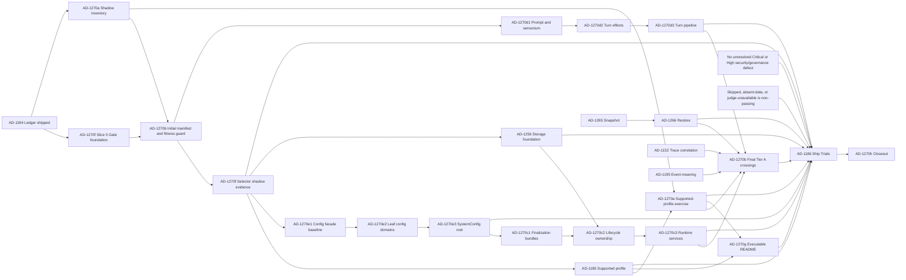

# AD-1270 — Platform Maturity Program

**Status:** Active — Captain approved execution on 2026-08-30
**Date:** 2026-08-25
**Scope:** OSS runtime architecture, verification, and truthful product surface
**Tracking model:** one program with independently buildable sub-ADs
**Tracking issue:** [#1324](https://github.com/seangalliher/ProbOS/issues/1324)

**Readiness context:** [Nooplex Readiness Map](nooplex-readiness.md). AD-1270 owns Tier A only; secure multi-mesh, Core Fabric, and emergence research have separate evidence gates.

## Decision

ProbOS will convert its strongest subsystems from individually implemented mechanisms into a continuously exercised, contract-checked, modular, and truthfully documented platform.

This is one dependency-ordered architecture program, not an invitation to file a separate issue for every structural observation. The program reuses existing decisions and reserved prompt owners where ownership already exists:

| Existing or reserved owner | Ownership retained here |
|---|---|
| AD-1184 / #1120 | Reconciled lifecycle ledger; already shipped |
| AD-1185 / #1121 | Supported `SystemConfig` profiles and flag dependency contract |
| AD-1186 / #1123 | Ship Trials release catalog and policy |
| AD-1256 / #1302 | Store registry and shared storage lifecycle |
| AD-1265 prompt reservation | Self-sufficient scheduled snapshots and verification |
| AD-1266 prompt reservation | Point-in-time all-or-nothing restore |

AD-1270 adds the missing connective architecture around those owners: capability truth, seam contracts, behavior-preserving decomposition, trustworthy impact selection, executable documentation, and a no-code program closeout.

**Allocation status:** GitHub issue #1324 authoritatively allocates AD-1270.
The generated ledger is a reconciliation view, not the authority for the next
free number. Before any new AD is proposed, enumerate Git subjects, GitHub issue
titles in all states, and in-flight `prompts/ad-*.md` reservations as required
by `.github/copilot-instructions.md`. This program assigns no new top-level AD.
The older prompt-only reservations AD-1262 through AD-1269 remain reserved for
collision avoidance until anchored in an allocation authority or explicitly
superseded/retired.

## Why Now

Measured on 2026-08-25:

| Surface | Baseline |
|---|---:|
| Production Python | 903 files / 325,497 raw lines |
| Python tests | 1,376 files / 468,186 raw lines |
| UI TypeScript/TSX | 579 files / 110,391 raw lines |
| Normalized source + tests | 908,196 raw lines |
| API route declarations | 432 |
| Intent descriptor sites | 119 |
| Durable databases declared by AD-1256 audit | 59 |
| Direct SQLite connect sites | 34 across 23 files |
| Latest frozen Python gate | 24,533 passed / 27 skipped in 15:54 |
| `cognitive_agent.py` | approximately 11,400 raw lines |
| `config.py` | approximately 7,600 raw lines |
| `runtime.py` | approximately 6,100 raw lines |
| `startup/finalize.py` | approximately 5,900 raw lines |

The recurring defect is now named in `DECISIONS.md`: a mechanism is built and tested, but the real caller never supplies what its consumer needs. Larger modules and distributed lifecycle ownership make that failure easier to create and harder to see. The response is not a rewrite. It is explicit truth, executable contracts, bounded extraction, and evidence-driven validation.

### Updated engineering baseline — 2026-08-30

The versioned [2026-08-30 baseline](platform-maturity-baseline-2026-08-30.md)
pins commit, host, toolchain, parser rules, artifact hashes, and limitations.
It found 38 qualifying completed legacy gate artifacts totaling 38,093 seconds;
16 red artifacts consumed 16,508 seconds. A recent 25,440-test green gate still
completed in 15:54, matching the earlier 24,533-test baseline. This supports a
narrow conclusion: repeated late discovery is a major measured cost; the data
does not prove every retry was architecturally caused.

The committed-tree source audit at `bf6c998` measured:

| Principle signal | Current baseline | Program interpretation |
|---|---:|---|
| Production Python files | 908 | Scale makes implicit ownership unaffordable |
| Classes over the ~500-line SRP review threshold | 66 | Triage signal; each needs an owner or documented exception |
| Classes over the ~15-method SRP review threshold | 77 | Triage signal; not every method count is itself a defect |
| Largest class | `CognitiveAgent`: 10,598 body lines / 189 methods | Material god object; AD-1270d owns decomposition |
| Next largest facade | `ProbOSRuntime`: 5,967 body lines / 107 methods | Material god object; AD-1270c owns decomposition |
| Concrete `ProbOSRuntime` reference files | 60 | Some are type-only/facade consumers; lower-layer concrete dependence must fall |
| Explicit `probos.protocols` import files | 37 | Useful substrate exists, but interface segregation is incomplete |
| External private-member candidates | 1,110 | Broad AST heuristic containing false positives; AD-1270b must classify before gating |
| Direct SQLite connect sites | 30 | AST heuristic; includes approved adapter/CLI candidates; AD-1256 owns classification |
| Task-creation calls | 180 | Broad candidate set, including same-named domain methods |
| Bare-expression task-creation candidates | 26 | Requires ownership/cancellation analysis; no positive ownership claim follows |
| Verified lower-to-higher layer violations | Not established | Two initial candidates were allowed `TYPE_CHECKING` + DI edges; naive package ranking rejected |

The audit is a prioritization baseline, not a violation ledger. AD-1270b must
replace broad lexical/AST candidate sets with deterministic domain-aware
classifiers before any count can fail a build. Type-only facade references,
approved adapters, generated compatibility surfaces, and cohesive large data
models may be justified. Size alone never proves successful extraction.

### Engineering-principle assessment

The principles are still actively used in review, but present compliance is
mixed rather than complete:

- **Single Responsibility:** materially violated in the central runtime,
    cognitive, startup, workforce, and memory owners listed above.
- **Open/Closed and Law of Demeter:** materially degraded by external private
    access. AD-1270c/d must replace each migrated access with a public narrow API;
    moving the same reach-through into another file does not count.
- **Interface Segregation and Dependency Inversion:** established by
    `probos.protocols`, constructor-injected newer services, and connection
    factories, but not consistently adopted. Extracted services may not accept a
    concrete `ProbOSRuntime` merely to recreate a service locator.
- **Liskov and typed contracts:** generally strong where Protocols, frozen
    dataclasses, and exact wire contracts are used. Compatibility-facade tests
    remain mandatory during extraction.
- **Layer discipline:** no verified violation follows from the current audit.
    The first two candidates are allowed type-only injected dependencies; a
    domain-aware import rule remains required.
- **Async discipline:** ownership remains unproven for 26 bare-expression
    candidates. AD-1270b must classify retained references, callbacks, and
    cancellation/drain behavior instead of equating syntax with ownership.
- **Cloud-ready storage:** incomplete. New stores must use `ConnectionFactory`;
    existing direct connects are an AD-1256 migration denominator.
- **Configuration discipline:** Pydantic remains the authority, but the
    7,741-line compatibility surface makes routine changes high-blast-radius;
    AD-1270e preserves the public import while moving domain ownership.

No AD-1270 sub-decision is complete merely because files became smaller. It
must reduce one of the measured coupling/ownership denominators without adding
a new violation elsewhere.

## Program Outcomes

1. Every advertised subsystem has a machine-readable owner, activation state, exercise evidence, and health evidence.
2. Every active Tier A P0 cross-layer value in the canonical manifest is proven through its real producer and real consumer.
3. Runtime and cognitive orchestration become compatibility facades over bounded services.
4. Configuration retains one stable public import surface while domain models gain clear ownership.
5. Every durable store has declared lifecycle, criticality, retention, and backup disposition through AD-1256.
6. Fast validation uses a fail-broad impact graph; release validation still runs every collected test exactly once.
7. Volatile README facts are generated from executable evidence.
8. AD-1186 Ship Trials prove the supported product rather than an everything-on laboratory configuration.

## Architecture Principles

- **Truth dimensions are orthogonal.** Present, configured, advertised, activated, exercised, and healthy are not synonyms.
- **A seam test crosses the seam.** A producer unit test plus a consumer unit test is not integration evidence.
- **Facades preserve compatibility.** Public methods, attributes, imports, defaults, and extension hooks remain while ownership moves behind them.
- **Selection accelerates; it does not authorize release.** Impact-selected tests may shorten feedback but never replace the frozen full gate.
- **Storage registration does not centralize queries.** AD-1256 owns lifecycle metadata and connection creation, not domain SQL.
- **Documentation derives facts.** Narrative remains human-authored; volatile counts and capability states come from executable authorities.
- **Residual risk is explicit.** Completion means fit for intended purpose with no unresolved Critical or High defect, not perfection.

## AD Map

| AD | Decision | Primary result |
|---|---|---|
| AD-1270a | Capability Truth Ledger and Activation Receipts | A subsystem cannot read healthy merely because it was constructed |
| AD-1270b | Distributed Seam Contract Catalog and Crossing Tests | P0 producer-to-consumer contracts have executable proof |
| AD-1270f | Fail-Broad Impact Selection and Balanced Full Gate | Fast feedback without false confidence or skipped release evidence |
| AD-1270e1 | Stable Configuration Facade Contract | Existing imports, defaults, aliases, schema, and dump order are frozen before movement |
| AD-1270e2 | Configuration Leaf-Domain Extraction | Leaf config models move by domain behind compatibility re-exports |
| AD-1270e3 | `SystemConfig` Root Extraction | Root composition moves last with exact compatibility |
| AD-1256 | Store Registry and Shared Storage Lifecycle | Existing storage decision supplies ownership, criticality, retention, and connection lifecycle |
| AD-1270c1 | Finalization Feature Bundles | `finalize.py` becomes an ordered facade over cohesive feature bundles |
| AD-1270c2 | Explicit Lifecycle Ownership | Start/stop ownership is registered once and unwound in reverse order |
| AD-1270c3 | Runtime Service Extraction | `ProbOSRuntime` delegates behavior while preserving its public API |
| AD-1270d1 | Prompt and Sensorium Composition Service | Prompt assembly moves behind agent-owned hooks with byte parity |
| AD-1270d2 | Turn Effects Service | Episode, event, trust, Hebbian, and outcome writes become exactly-once owned effects |
| AD-1270d3 | Cognitive Turn Pipeline | Stage order and early-return semantics become explicit and testable |
| AD-1265 | Self-Sufficient Snapshot | Every promoted snapshot is independently verifiable |
| AD-1266 | Point-in-Time Restore | Snapshot/restore/reboot/read closes the storage recovery loop |
| AD-1270g | Executable Capability Documentation | README factual blocks cannot silently drift |
| AD-1270h | Platform Maturity Closeout | No-code evidence aggregation after AD-1186 Ship Trials |

## Completion and Safety Prerequisites

The graph below describes prerequisites for completing each decision. The delivery waves later in this document describe the chosen execution order. AD-1270a may ship its shadow inventory before AD-1185, but it cannot meet its supported-profile exercise acceptance criteria until AD-1185 exists.

Tier B federation work remains owned by AD-1196 through AD-1198 and #1140. It
does not gate Tier A and is intentionally absent from this completion graph.

---

## AD-1270a — Capability Truth Ledger and Activation Receipts

### Problem

ProbOS currently has several incompatible meanings for “available.” A class may exist, a flag may be enabled, a tool may be advertised, and a runtime may report a default healthy state without any production request having exercised the path. This is the root of the “built, tested, inert” defect family.

### Decision

Add a read-only maturity ledger with orthogonal fields:

- `present`: implementation/import exists;
- `configured`: the selected profile requests it;
- `advertised`: a user or agent can discover it;
- `activated`: startup successfully wired a production owner;
- `exercise.attempts`, `last_success`, `last_failure`;
- `health.state`, `observed_at`, `source`;
- `live`: derived from the preceding evidence, never stored directly.

No exercise sample means health is `unknown`, not `available`.

### Ownership

- New leaf package: `src/probos/maturity/model.py`, `registry.py`, `report.py`.
- Declarations and probes remain beside the subsystem that owns them.
- Reuse `routers.tools.list_capability_catalog`, runtime status projection, event markers, and Doctor checks; do not create another capability registry or health engine.

### Migration

1. Inventory-only shadow report with no API or routing effect.
2. Add activation receipts at startup ownership points.
3. Add exercise receipts at real ingress/consumer completion points.
4. Exercise P0 capabilities through the AD-1185 supported profile.
5. Expose a bounded read-only report for Doctor, CI, and documentation generation.

Steps 1–3 may land before AD-1185. Steps 4–5 and this AD's final acceptance require the versioned AD-1185 supported profile; an inventory over an ad hoc local configuration is not product evidence.

### Initial P0 Subsystems

- Natural-language request to completed intent DAG.
- Governed tool invocation and refusal.
- Approval to fulfilment to resumed turn.
- CrewSession create, execute, verify, deliver, and recover.
- Episodic store and recall.
- Self-modification validation and warm restore.
- Snapshot verification and restore once AD-1265/1266 land.

Authenticated federation is Tier B evidence owned by #1140, not a Tier A P0
capability. Its stable seam ID is retained in the manifest as non-gating.

### Acceptance

- Every supported-profile advertised capability has one owner and one evidence source.
- Disabled, activated-but-unexercised, successful, failed, and degraded states are tested.
- No subsystem reports healthy solely because its object was constructed.
- A supported-profile smoke run produces an activation report with zero unexplained advertised-but-unactivated P0 capabilities.
- The ledger is observation-only and changes no routing, permission, trust, or startup decision.

### Do Not Build

- A second runtime registry, a second health model, or a general telemetry warehouse.
- Auto-enabling features from ledger state.
- A mutable operator API in this AD.

---

## AD-1270b — Distributed Seam Contract Catalog and Crossing Tests

### Problem

ProbOS repeatedly proves producers and consumers independently while allowing the value crossing between them to be absent, malformed, stale, misordered, or interpreted differently.

### Decision

Create domain-split metadata under `docs/development/seams/*.yaml`, checked by `scripts/check_seam_contracts.py`. The catalog is documentation and test discovery metadata, not runtime orchestration.

The canonical P0 denominator is
[`docs/development/seams/p0-manifest.yaml`](seams/p0-manifest.yaml). “100%”
means every active Tier A ID resolves to one contract and one collecting
production-crossing test. Adding an ID is explicit; removing one moves it to
the manifest's tombstones with rationale, replacement, decision, and date.
GitHub #1324 links this manifest and does not maintain a competing list.

Each contract records:

- owning domain and severity tier;
- producer symbol or trigger;
- carrier type and version;
- consumer symbol;
- acceptance and rejection rules;
- ordering and idempotency requirements;
- failure policy;
- production-crossing test node ID;
- runtime evidence marker where applicable.

Typed carrier classes stay in the lowest shared code layer. The catalog does not dispatch, validate production traffic, or own lifecycle.

AD-1270b is delivered as independently accepted slices, never one repository-
wide implementation wave:

1. **Seam manifest slice:** schema, stable IDs, tombstone rules, symbol/test
    resolution, and one crossing-test family per later bounded build.
2. **Architecture fitness slice:** versioned baseline and
    `scripts/check_architecture_principles.py`, with explicit reviewed exceptions
    rather than hidden thresholds.
3. **Final Tier A crossing closeout:** after recovery, runtime/cognitive
    decomposition, trace correlation, event meaning, and supported-profile
    exercise exist, fill every active Tier A test node and prove collection.

The architecture fitness slice reports:

- classes crossing the repository's ~500-line or ~15-method SRP review trigger;
- external private-member reach-through and concrete-runtime dependencies below
    approved facade/composition boundaries;
- lower-to-higher layer imports;
- direct database connections outside approved connection adapters;
- unowned `asyncio.create_task` calls;
- source-text contract tests, classified as architectural/security invariants
    or candidates for behavioral replacement.

The first version classifies the broad candidates in the baseline report,
freezes only reviewed violations/exceptions, and rejects **new** violations.
Each decomposition slice must reduce its relevant denominator. Existing debt is
not grandfathered as compliant and may not be copied into a new module.

### P0 Seam Authority

The stable IDs and Tier A/Tier B boundary live only in the canonical manifest.
Missing test IDs, skipped collection, absent data, and unavailable judges are
non-passing. The manifest begins with seven Tier A IDs and one non-gating Tier B
federation ID; denominator changes follow its tombstone rule.

### Acceptance

- Catalog symbols resolve against the live tree.
- Test node IDs collect and pass.
- Every P0 test enters through the real producer and observes the real consumer.
- Endpoint-only or fake-only pairs do not qualify as crossing evidence.
- New P0 cross-layer features cannot merge without a seam entry and crossing test.
- The seam and architecture-fitness slices each have their own focused tests,
    review, commit, and acceptance record.
- The architecture fitness check is deterministic on Windows and Linux, rejects
    an injected violation in each category, and emits a machine-readable report.
- New violations fail immediately; reductions update the reviewed baseline in
    the same commit, while exceptions require rationale, owner, and expiry/removal
    condition.
- No central code object imports or executes the catalog.

### Do Not Build

- A universal runtime message bus schema.
- A replacement for domain protocols or Pydantic models.
- A source-text regex that mistakes comments for behavior.

---

## AD-1270f — Fail-Broad Impact Selection and Balanced Full Gate

### Problem

The full Python gate is approximately 16 minutes and contains more than 24,500 passing tests. Running it after every small issue limits throughput, while filename-only selection cannot see fixtures, dynamic imports, indirect consumers, or seam contracts.

### Decision

Begin with **Slice 0 — gate economy foundation**, before impact selection:

- one canonical gate wrapper runs deterministic generated-reference and
    structural preflight checks before pytest;
- preflight-only may inspect a staged candidate, while a full gate requires a
    reviewed local commit and refuses an index that differs from `HEAD`;
- it refuses overlapping gates, unstaged/uncommittable code, mutation backups,
    hidden collection selectors, a changing tree, and a worktree whose imports
    or pytest runner resolve to another checkout;
- it preserves distinct wrapper, preflight, and pytest exit codes;
- every attempt writes unique log, JUnit, phase-duration, tree-snapshot, and
    manifest artifacts;
- full success emits a caller-named atomic receipt binding the committed tree
    to hashed manifest/JUnit evidence, and an external janitor removes the
    linked worktree even if the wrapper is killed;
- local release-advancement instructions use the wrapper; the orchestrator
    validates its receipt through advancement and explicitly pushes and
    verifies the configured branch ref; direct pytest output cannot authorize
    local release advancement, push, or issue closure;
- focused, diagnostic, installation, historical-prompt, and CI tests may remain
    direct pytest invocations because they are not local release authority.

Slice 0 is complete only after focused wrapper/consumer tests, an isolated
worktree preflight, adversarial review, and one green canonical full gate. It
does not close AD-1270f; it creates trustworthy evidence for the selector and
balanced-gate work below.

Build `scripts/select_tests.py` as an acceleration tool, never as release authority. It combines:

- per-test coverage contexts from a known-green full run;
- transitive static imports;
- changed test files and shared fixtures;
- AD-1270b seam tests;
- explicit blast-radius rules for architectural files.

The selector fails broad to the full gate for unknown modules, stale/missing maps, dynamic imports it cannot resolve, deletions/renames, or changes to runtime/startup, config root, protocols, events, `conftest.py`, pytest configuration, dependency manifests, or the selector itself.

The frozen release gate remains mandatory. Its complete collected node set is duration-balanced across workers/shards, with union equality and duplicate detection.

Evidence uses immutable manifests:

- a representative historical BF corpus is predeclared before scoring and pins each change/commit, expected affected test nodes, and content hash;
- each shadow run pins the changed paths, unique tree fingerprint, selector result, full collected-node result, and selector/map version;
- performance runs pin OS, Python, pytest, xdist, physical-core count, commit, and complete node-manifest hash;
- every canonical wrapper attempt is retained. Late-discovery rate is computed
    over unique source-changing tree fingerprints; retries of an identical tree
    remain visible as cost but cannot pad the pass/fail sample;
- old/new runner benchmarks execute the same final commit and node-manifest hash.

Measurement series use **fixed enrollment** declared before observation:

- selector shadow evidence is the first 20 eligible unique trees represented by source-changing tree
    fingerprints after the checker/corpus commit and recorded UTC cutoff;
- leaf feedback uses the predeclared 20-case representative corpus, with no
    substitutions after its manifest hash is committed;
- canonical red-rate evidence is the first 20 eligible unique source-changing
    tree fingerprints after the wrapper rollout commit and recorded UTC cutoff;
- every attempt, including same-tree retries and invalid attempts, remains in
    the artifact ledger; invalidation reasons are a closed vocabulary declared by
    the wrapper schema before enrollment starts;
- extending, restarting, or excluding a series requires a Captain-ratified
    decision recorded before the replacement series runs.

### Acceptance

- Canonical preflight completes in under 90 seconds on the pinned reference
    host when generated artifacts are current and no staged prompt requires the
    phantom-API scan.
- A failed preflight starts no full pytest process; overlapping and changing
    trees fail closed; wrapper artifacts cannot overwrite a prior attempt.
- No maintained local release workflow advances, pushes, or closes from direct
    `pytest tests/` output; only a validated canonical receipt is release
    authority. Focused/diagnostic documentation and CI may retain direct pytest
    commands while runner sharding is evaluated from manifested duration data.
- Zero misses over the predeclared historical BF mutation corpus and the first
    20 eligible unique-tree shadow comparisons after the fixed cutoff.
- Selected leaf-change feedback p95 is under 90 seconds over every run in a
    predeclared representative 20-case corpus on one pinned reference-host
    fingerprint; cases may not be replaced after measurement starts.
- Complete-gate critical path is at most 75% of the same-runner baseline, target <=12 minutes from the 16-minute baseline.
- Every collected node runs exactly once; no skip, deselection, timeout weakening, or semantic change is used to meet the target.
- Any uncertainty selects more tests, never fewer.

### Do Not Build

- A selector that permits merge, push, or issue closure without the required frozen full gate.
- Test prioritization based only on filenames or historical pass frequency.
- Quarantine or deletion of slow tests as a performance strategy.

---

## AD-1270e1/e2/e3 — Configuration Domains With Stable Public Imports

### Problem

`config.py` owns hundreds of models and a very large root contract. More than 600 source/test files import `probos.config`, so a direct split would create a compatibility migration larger than the problem.

### Decision

Reuse AD-1185 as the supported-profile authority. Introduce `src/probos/config_models/` while keeping `probos.config` as the permanent compatibility facade and `load_config` entry point.

### AD-1270e1 — Stable Facade Contract

- Record every public config symbol, default, alias, validator outcome, schema, field order, and import identity required by consumers.
- Add default-config and tracked-YAML `model_dump()` golden parity.
- Add normalized JSON-schema parity and mutable-default independence checks.
- No model moves in e1.

### AD-1270e2 — Leaf-Domain Extraction

- Move leaf models in bounded batches into `config_models/{core,cognition,experience,integrations,operations}.py`.
- Re-export each class from `probos.config` before moving the next batch.
- Run focused importer/config tests and the affected supported-profile smoke after each batch.

### AD-1270e3 — Root Extraction

- Move `SystemConfig` composition into `config_models/root.py` last.
- Preserve all field names, order, defaults, aliases, validators, environment overrides, and serialized shape.
- Leave `config.py` as a thin permanent facade with no domain model bodies.

### Acceptance

- Zero removed public imports.
- Minimal and supported profiles parse and boot unchanged.
- Default and tracked-YAML dumps are byte-equivalent after normalization.
- Commercial overlay imports remain valid.
- No edit to `config/system.yaml` is needed to complete the extraction.

### Do Not Build

- A new configuration format, flag cleanup, default change, or “everything on” profile.
- A one-commit move of all models.

---

## AD-1256 — Store Registry and Shared Storage Lifecycle

### Existing Owner

AD-1256 / #1302 remains the storage decision. AD-1270 does not renumber or replace it.

### Program Integration

- Add metadata-only `StoreDescriptor` declarations using the existing `ConnectionFactory` seam.
- Required fields: owner, roots/paths, criticality, lifecycle owner, retention policy, backup disposition, restore disposition, and reconstruction method where excluded.
- Begin in inventory-only shadow mode.
- Register the hand-maintained shutdown sidecars first.
- Require every new store to register immediately.
- Migrate existing stores one startup phase at a time; preserve constructor `db_path` and `connection_factory` compatibility until ownership transfers atomically.
- The registry owns lifecycle metadata and connection creation, not domain queries or one giant database.

### Program Acceptance

- Every durable store has one lifecycle owner and an explicit backup/retention disposition.
- No duplicate close and no startup path that makes an optional store boot-critical by accident.
- AD-1265 may consume registry metadata when present but retains filesystem discovery as a fail-safe until migration is complete.
- AD-1266 restores only the declared point-in-time unit and leaves excluded stores untouched.

---

## AD-1270c1/c2/c3 — Runtime Composition and Lifecycle Decomposition

### Problem

`runtime.py` and `startup/finalize.py` both act as composition roots and behavioral owners. This obscures startup order, creates hand-maintained shutdown lists, and makes unrelated features share a high-blast-radius file.

### AD-1270c1 — Finalization Feature Bundles

- Move cohesive `_wire_*` bodies into `startup/features/{crew,cognition,integrations,governance,experience}.py`.
- Keep `finalize_startup()` as the ordered compatibility facade returning the existing typed result.
- Preserve startup order, public runtime attributes, log/event order, and feature flags.
- No service extraction from `ProbOSRuntime` yet.
- Migrate and gate exactly one feature bundle at a time; no build may move all five domains together.

### AD-1270c2 — Explicit Lifecycle Ownership

- Add `startup/lifecycle.py` with typed start/stop registrations and reverse-order shutdown.
- AD-1256 owns store registrations.
- New services use lifecycle ownership immediately; existing services migrate one phase at a time.
- Keep each legacy shutdown entry until the corresponding service proves exactly one owner.

### AD-1270c3 — Runtime Service Extraction

- Extract natural-language processing/DAG execution, governed intent submission, and status projection into constructor-injected services.
- Preserve every public `ProbOSRuntime` method and attribute as a delegating compatibility API.
- `runtime.start()` may orchestrate startup phases but may not construct feature internals after completion.
- Move one service family per independently reviewed build, with facade parity and crossing evidence before the next family moves.

### Acceptance

- A real runtime boots the AD-1185 supported profile, executes a real `read_file` path, reports status, and stops with no leaked lifecycle owners.
- Startup cancellation and partial failure unwind only successfully started owners, once, in reverse order.
- Existing extension hooks and commercial overlay wiring remain valid.
- `finalize.py` contains ordering and compatibility only, not feature constructors.
- Runtime public API and startup event ordering remain stable.

### Do Not Build

- A new global service locator, dependency-injection framework, or repository split.
- Private-member access from extracted services.
- A big-bang runtime rewrite.

---

## AD-1270d1/d2/d3 — `CognitiveAgent` as a Turn Facade

### Problem

`CognitiveAgent` combines prompt assembly, sensorium, lifecycle control, tool-loop orchestration, reply processing, and learning effects. Subclasses rely on dynamic hooks, so naive extraction can silently bypass behavior even when tests stay green.

### AD-1270d1 — Prompt and Sensorium Composition

- Extract default prompt and context assembly into `cognitive/prompt_composer.py` and `cognitive/sensorium.py`.
- Reuse existing context assembly primitives.
- Collaborators invoke extension hooks through the agent instance; they do not copy hook logic.
- Preserve exact default prompt bytes and LLM call count.

### AD-1270d2 — Turn Effects

- Extract episode, event, trust, Hebbian, workflow-cache, and outcome writes into `cognitive/turn_effects.py`.
- Give each effect an explicit exactly-once owner and idempotency key where persistence can retry.
- Preserve cancellation propagation and existing fail/log/degrade tiers.
- Migrate one effect family per independently reviewed build; episode, event, trust, Hebbian, workflow-cache, and outcome ownership do not move as one sweep.

### AD-1270d3 — Turn Pipeline

- Add `cognitive/turn_pipeline.py` with explicit stages and early-return semantics.
- `CognitiveAgent._run_cognitive_lifecycle()` delegates to the pipeline while public lifecycle methods and `_conversational_*` hooks remain on the agent.
- Do not change `CognitiveSpine`, `DmReplyPipeline`, `IntentResult`, or generated-subclass contracts.

### Acceptance

- One real built-in subclass and one generated-style subclass complete a production-faithful turn.
- Default prompt bytes, await order, early returns, cancellation, metadata, and LLM call count remain unchanged.
- Episode, conclusion, event, trust, and Hebbian effects occur exactly once on success and retain existing failure semantics.
- AD-1270b crossing tests cover tool result -> reply -> episode and correction -> patch -> retry -> learning.

### Do Not Build

- A new agent lifecycle or a second reply pipeline.
- Procedural behavior that bypasses instructions-first cognitive agents.
- Direct calls to extracted helpers that bypass subclass hooks.

---

## AD-1265 / AD-1266 — Verified Recovery Loop

These decisions already have ready prompts and remain independently buildable. The maturity program adds one integration requirement:

> A supported-profile runtime must write representative critical rows, create and verify a promoted snapshot, restore it into a point-in-time tree, reboot, and read the restored state through normal production connection paths.

AD-1265 remains responsible for snapshot scheduling, self-sufficiency, promotion, digest verification, and declared exclusions. AD-1266 remains responsible for all-or-nothing restore, sidecar handling, move-aside rollback, and live-runtime refusal.

Before build, refresh stale BF numbering in the prompt headers against live GitHub. Do not change their storage semantics to fit this program.

---

## AD-1270g — Executable Capability Documentation

### Problem

README currently carries volatile facts such as agent counts, test counts, phase status, and module sizes that have diverged substantially from the live system. It also describes scheduling more centrally than the ratified AD-1231 hybrid boundary.

### Decision

Add `scripts/gen_readme_facts.py --check`, following the existing config-reference generator pattern. Generate only bounded factual blocks; narrative prose remains human-owned.

Create a versioned README fact inventory as the denominator. Every in-scope volatile claim records its source span, authority, and disposition (`generated` or a justified stable exemption). In scope: counts, current phase/status, module-size statements, capability availability, supported-profile contents, and command inventories. A structured Markdown check reports any new candidate claim that is absent from the inventory.

Inputs:

- AD-1270a capability truth report;
- AD-1185 supported profile;
- CLI parser and slash-command registry;
- agent/pool/intent declarations;
- current test collection and release gate artifact;
- repository paths verified at generation time.

Coordinate rather than duplicate:

- AD-1137 owns Quick Start execution and onboarding stability.
- AD-1183 owns dated competitive claims.
- AD-1184 owns lifecycle-number reconciliation.
- The [Nooplex Readiness Map](nooplex-readiness.md) owns maturity terminology and permitted Nooplex claims.

### Acceptance

- Generator is deterministic and idempotent on Windows and Linux.
- `--check` is hermetic and runs in the ordinary test suite.
- Every generated capability row resolves to an owner and evidence in AD-1270a.
- Every documented command parses; every linked local path exists.
- Every in-scope volatile claim appears in the versioned inventory.
- Zero in-scope volatile claim remains manually maintained outside generated blocks; stable exemptions may not depend on runtime-derived counts or current status.
- README scheduling language matches AD-1231: agents choose cognitive work; deterministic services own durable workflow time.
- README and `docs/architecture/federation.md` use the readiness map's claim vocabulary: experimental federation is not described as a completed Nooplex Core.

### Do Not Build

- Whole-file README generation.
- Marketing copy derived from runtime state.
- Network-dependent documentation checks.

---

## AD-1270h — Platform Maturity Closeout

AD-1270h creates no evaluator and no new runtime behavior. It is a closure record that assembles immutable artifacts into AD-1186 Ship Trials:

- commit and supported-profile hashes;
- capability truth report;
- P0 seam-contract results;
- lifecycle-owner report;
- store inventory and backup dispositions;
- snapshot/restore/reboot/read drill;
- complete collected-test manifest and gate duration;
- AD-1152 correlated run/tool evidence and AD-1195 durable event-semantics report;
- supported-profile latency, error, and bounded-resource evidence;
- security/governance residual-risk register with zero unresolved Critical or High defect;
- non-vacuous Ship Trials evidence proving skipped, absent-data, and judge-unavailable outcomes did not pass;
- README fact check;
- Ship Trials result and residual-risk register.

AD-1186 remains the release evaluator. AD-1270h closes only when the evidence set is complete and the supported-profile Ship Trials pass.

---

## Delivery Plan

#1324 is a coordination-only completion epic, never a substitute for bounded
WIP. The Captain activated Delegated AD Execution Mode on 2026-09-01 for the
existing open issue queue and the already-versioned incomplete slices in this
plan. Implementation remains one issue (or at most three tightly coupled
issues), but the agent may now sequence the remaining AD-1270 slices by this
plan's dependency graph and make in-envelope reversible decisions without
separate Captain admission. This delegation does not waive acceptance evidence,
compatibility, adversarial review, canonical-gate receipts, repository-boundary
rules, or the hard escalation boundaries in `.github/copilot-instructions.md`.

### Wave 0 — Authority

- Confirm AD-1184 generated ledger is current and includes AD-1270 plus all pre-existing reservations.
- Treat the generated ledger as a reconciliation view. Any new allocation uses
    the required Git-subject, all-state GitHub-title, and prompt-reservation
    enumeration; this plan assigns no next-free number.
- Reconcile prompt-only AD-1262 through AD-1269 into a ledger authority or explicitly supersede/retire them; until then Wave 0 remains open even though AD-1270 itself is authoritatively allocated by #1324.
- Create one GitHub epic for this program; track sub-ADs as checkboxes rather than separate issues until a sub-AD enters implementation.

### Wave 1 — Truth and Guardrails

- AD-1270f Slice 0 canonical preflight/gate wrapper and timing manifest.
- AD-1270a capability truth shadow report.
- AD-1270b seam-manifest slice.
- AD-1270b architecture-fitness slice.
- AD-1270b crossing tests, one P0 family per bounded build.
- AD-1270f selector in shadow mode plus balanced full-gate manifest.

Exit: unsupported activation claims become visible; selection has demonstrated zero misses but does not yet change required gates.

### Wave 2 — Supported Product and Foundations

- AD-1185 supported profile.
- AD-1270e1 config compatibility baseline.
- AD-1256 inventory-only store registry and lifecycle metadata.

Exit: one supported product configuration boots; config and storage migrations have frozen compatibility contracts.

### Wave 3 — Behavior-Preserving Decomposition

- AD-1270c1 -> c2 -> c3 in separate bounded builds, with one feature bundle, lifecycle-owner batch, or runtime service family moved per build.
- AD-1270d1 -> d2 -> d3 in separate bounded builds, with one prompt/sensorium slice or effect family moved per build.
- AD-1270e2/e3 by domain batches, not one sweep.

Exit: central files are facades over owned services; no public API or default behavior changed.

### Wave 4 — Recovery

- AD-1265 snapshot and verification.
- AD-1266 restore.
- Supported-profile snapshot/restore/reboot/read drill.

Exit: every critical store is included or explicitly excluded with evidence, and recovery is executable rather than aspirational.

### Wave 5 — Product Truth and Release

- AD-1270g executable README facts.
- AD-1186 Ship Trials.
- AD-1270h no-code closeout.

Exit: the product description, supported configuration, live exercise evidence, and release policy agree.

## Program Metrics

| Metric | Baseline | Target |
|---|---:|---:|
| P0 advertised capabilities with activation + exercise owner | not centrally measurable | 100% |
| Active Tier A P0 seams with production-crossing tests | not centrally measurable | 100% |
| Impact-selector shadow misses | unknown | 0 over versioned historical corpus + 20 manifested shadow runs |
| Leaf-change feedback p95 | full gate often used | <90 seconds over 20 valid runs on one pinned host fingerprint |
| Frozen full-gate critical path | 15:54 | <=12:00 on same host fingerprint, same node-manifest hash |
| Legacy full-gate artifact observation | 16 / 38 red; 16,508 / 38,093 seconds red | Context only; not an acceptance series |
| Canonical full-gate late-discovery rate | Not yet measured | <10% over the first 20 eligible unique source-changing tree fingerprints after the fixed cutoff |
| Canonical full-gate time spent red | Not yet measured | <10% of all canonical broad-gate minutes; identical-tree retries remain visible |
| Classes above SRP review thresholds | 66 by body lines; 77 by method count | Zero unexplained; named central owners become bounded facades |
| External private-member candidates | 1,110 broad candidates | Classify first; then zero new reviewed violations and per-domain reduction |
| Verified lower-to-higher layer imports | Not established | 0 after domain-aware classification |
| Bare-expression task-creation candidates | 26 | Classify ownership/cancellation; zero verified unowned tasks |
| Direct SQLite connect sites | 30 broad candidates | 0 outside approved adapters/explicit maintenance boundaries after AD-1256 |
| Durable stores with owner/criticality/retention/backup disposition | incomplete | 100% |
| Public config imports removed | 0 | 0 |
| README volatile facts checked from authorities | 0% | 100% of versioned in-scope fact inventory |
| Unresolved Critical/High program defects at close | unknown | 0 |

Module line count is a diagnostic, not the acceptance criterion. Extraction is successful when ownership, blast radius, and contracts improve without changing behavior; a smaller file that merely moves a god object elsewhere does not pass.

## Program Definition of Done

The program is done when:

- every supported-profile advertised P0 subsystem has independent advertisement, activation, exercise, and health evidence;
- every active Tier A P0 seam in the canonical manifest has a production-crossing test;
- runtime, finalization, cognitive turn processing, and configuration retain their public APIs while domain behavior is owned behind bounded facades;
- every durable store has one lifecycle owner and declared criticality, retention, backup, and restore disposition;
- snapshot/restore/reboot/read succeeds through normal production paths;
- impact selection has zero observed shadow misses and the complete release gate still executes every collected test exactly once;
- README factual blocks pass `--check` and every capability claim resolves to evidence;
- AD-1186 Ship Trials pass on the supported profile;
- scoped Diff Reviewer review finds no unresolved Critical or High defect.
- an automated architecture fitness report classifies the broad 2026-08-30
    candidates, freezes reviewed violations/exceptions, and rejects new
    SRP-threshold classes, external private reach-through, lower-to-higher
    imports, unowned tasks, and direct database connections;
- `CognitiveAgent`, `ProbOSRuntime`, `startup/finalize.py`, and `config.py` meet
    their explicit facade/extraction acceptance criteria. They cannot use a
    generic exception; changing this named scope requires a Captain-ratified
    decision recorded in `DECISIONS.md` and #1324;
- **Named god-object non-exception rule:** none of those four owners may be
    marked complete through an architecture-fitness allowlist or size waiver;
    completion requires the planned compatibility-facade extraction or a
    Captain-ratified change to this program's scope.
- AD-1152 trace correlation and AD-1195 durable event meaning cover P0 paths;
- supported capabilities have no unresolved Critical or High security or
    governance defect, and skipped/absent-data/judge-unavailable Ship Trials
    remain non-passing;
- no maintained developer/agent workflow bypasses the canonical local broad
    gate, and the measured red-gate and feedback targets hold over the required
    consecutive-run windows.

Done means fit for intended purpose with understood and acceptable residual risk. It does not mean that no further improvement can be found.

## Risks and Controls

| Risk | Control |
|---|---|
| Maturity ledger becomes another source of truth | Derive from owners and receipts; no behavior authority |
| Seam catalog becomes a central god object | Domain-split metadata; runtime never imports it |
| Lifecycle migration double-stops services | One-owner transfer per service with legacy entry retained until proof |
| Cognitive extraction bypasses subclass hooks | Call hooks through agent; real subclass crossing tests |
| Config split breaks imports or field order | Permanent facade; e1 baselines before movement |
| Impact selector misses dynamic consumers | Fail-broad rules; shadow evidence; full release gate remains mandatory |
| Storage registry turns into query centralization | Metadata/lifecycle only; domain SQL remains local |
| Generated docs erase useful explanation | Generate facts only; narrative remains human-owned |
| Program stalls feature delivery | Each sub-AD is bounded; no big-bang branch; stop after each measurable outcome |

## Explicit Non-Goals

- Splitting ProbOS into multiple repositories.
- Replacing SQLite with Postgres or consolidating the 59 databases.
- Rewriting the agent lifecycle, intent bus, consensus engine, or HXI.
- Enabling every default-OFF feature.
- Achieving zero open issues before feature work continues.
- Using line-count reduction as a substitute for architectural ownership.
- Creating a new issue for every seam or residual observation.
