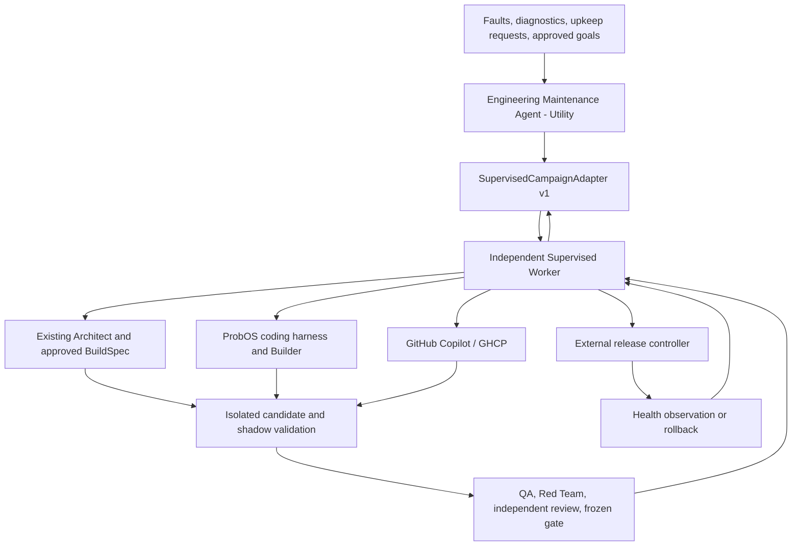

# AD-1299 - ProbOS Self-Maintenance Architecture

**Status: planned, not implemented.** This is an OSS architecture decision, not
an active Supervised Worker campaign or permission to start one. No runtime,
deployment, governance policy, or campaign state changes are authorized here.

**Tracking:** [Epic #1352](https://github.com/seangalliher/ProbOS/issues/1352).
See the [roadmap](roadmap.md#probos-self-maintenance-ad-1299) and the append-only
[decision record](../../DECISIONS.md#ad-1299-2026-09-06---governed-probos-self-maintenance).

## Purpose and boundary

A Utility-tier **ProbOS Engineering Maintenance Agent** diagnoses, repairs,
maintains, and enhances ProbOS by composing its existing engineering and
self-modification systems. It is an instructions-first `CognitiveAgent`, not
another coding loop, scheduler, or root of trust. Its proposed implementation
name is `EngineeringMaintenanceAgent`; this document does not claim that class
is already implemented.

**Supervised Worker remains independent.** It owns campaign admission,
authority, durable campaign state, operation reconciliation, evidence
acceptance, review requirements, and completion. ProbOS is both the system
being maintained and one possible execution backend. It cannot authorize its
own promotion or repair the governance layer that decides whether to accept it.

The boundary is a versioned **`SupervisedCampaignAdapter`**, not a vendored copy,
fork, in-process import, or reimplementation of Supervised Worker. The trusted
Worker installation, policy, credentials, and durable state stay outside the
candidate's writable environment. Root-of-trust independence requires enforced
process/filesystem isolation; a different directory under the same unrestricted
principal is not a security boundary.

## Existing foundations and measured limits

These are inspected source contracts, not a claim that a running vessel has
exercised the proposed end-to-end path.

| Foundation | Reuse and boundary |
|---|---|
| [EngineeringAgent](../../src/probos/cognitive/engineering_officer.py) | The existing Domain-tier Engineering officer provides analysis and optimization proposals. Keep that role and the chain of command; the new Utility agent owns the scoped maintenance-facing cognitive lifecycle, not department leadership. |
| [RepairBrief](../../src/probos/cognitive/repair_brief.py) and [RepairDispatcher](../../src/probos/cognitive/repair_dispatch.py) | AD-1172 already carries a harness-neutral brief and prepares a Captain-approved target choice without running a harness. Reuse its fault identity, brief, and approval surface; do not add a parallel fault store or target chooser. |
| [Repair verification](../../src/probos/cognitive/repair_verification.py) | The existing verifier can label a changed error signature `repaired` even when the operation still fails. Preserve that fault-specific meaning; it is not acceptance evidence for the requested behavior or runtime promotion. |
| [ArchitectAgent](../../src/probos/cognitive/architect.py) | Grounded engineering proposals. Retain its existing role; adding a Utility maintenance agent does not reclassify the Architect. |
| [Builder and execute_approved_build](../../src/probos/cognitive/builder.py) | Existing `BuildSpec` and build execution. The helper writes into the supplied `work_dir`; its branch creation does not establish runtime isolation. Its embedded code-review rejection is currently a soft gate, not independent promotion approval. |
| [NativeBuilderHarness](../../src/probos/cognitive/swe_harness/native_builder.py) | Existing ProbOS coding harness and tool loop. Passing a directory in a prompt does not enforce tool filesystem confinement. |
| [SelfModificationPipeline](../../src/probos/cognitive/self_mod.py) | Reuse design, validation, sandbox, probationary trust, and behavioral monitoring through injected dependencies. Maintenance candidates must bind registration and pool creation to the shadow runtime, never the active runtime. |
| [CodeValidator](../../src/probos/cognitive/code_validator.py) | Validates generated agent source, including agent-schema conformance. It is not a general validator for arbitrary runtime modules and is not a substitute for isolation or repository gates. |
| [SystemQAAgent](../../src/probos/agents/system_qa.py) and [RedTeamAgent](../../src/probos/agents/red_team.py) | Reuse QA and adversarial checks with campaign-bound inputs and results. Merely registering an agent or producing a verdict does not prove the candidate was tested. |
| [TrustNetwork](../../src/probos/consensus/trust.py) and [episodic memory](../../src/probos/cognitive/episodic.py) | Learn from verified attempted outcomes; neither a high trust score nor a remembered lesson grants authority. |
| [Repository test gate](../../scripts/run_test_gate.py) | Reuse the canonical frozen-tree validation and receipts; a harness exit or a selected subset is not the broad gate. |

The closed [self-diagnosis and repair epic #1095](https://github.com/seangalliher/ProbOS/issues/1095)
owns AD-1166 through AD-1173. Its closure records the shipped fault/diagnose/repair
loop; its original problem statement is historical, not a current absence
claim. AD-1299 extends those foundations with independently governed campaigns
and immutable runtime promotion rather than reopening or duplicating them.

The [Supervised Worker architecture](https://github.com/seangalliher/supervised-worker/blob/main/docs/architecture.md)
currently describes Copilot execution and version-2 role handoffs. The adapter
and ProbOS-backend support below are proposed integration work, not a claim
that the present plugin exposes a backend-neutral service API. Adapter v1 and
Worker handoff v2 are separate version namespaces.

## Ownership and cognitive lifecycle

- **Perceive:** read scoped diagnostics, existing fault records, source/test
  evidence, and relevant episodes. Resolve operational paths and release identity
  from the process/deployment authority, never from a repository-relative guess.
- **Decide:** use instructions-driven reasoning to diagnose, classify the work,
  choose an existing engineering capability, and propose a bounded objective.
  An agent's classification is a proposal; the Worker validates authority.
- **Act:** obtain an Architect-reviewed contract, submit it through the adapter,
  and collaborate with Builder, QA, and Red Team within the admitted campaign.
  Deterministic services own transitions; agents own engineering judgment.
- **Report:** project authoritative campaign evidence into existing work/approval
  surfaces and episodic memory. Distinguish proposed, built, tested, promoted,
  healthy, rolled back, blocked, failed, and unknown outcomes. Reports and
  ProbOS work-item status are not campaign completion authority.

No second durable campaign database or scheduler is introduced in ProbOS.
Adapter caches and work-item projections are disposable and recoverable from
Worker-issued identity/revision receipts. New dependencies use narrow injected
protocols; eventual configuration belongs in the existing Pydantic models.
Autonomous repair, maintenance, and enhancement admission default to disabled.
Without a compatible, authenticated Worker, diagnosis and proposals remain
available but mutation and promotion are blocked with an explicit escalation.

## Separate authority classes

| Class | Permitted objective | Required authority |
|---|---|---|
| Repair | Restore an existing approved behavior against a reproduced defect and a discriminating regression test. | Captain approval, or an explicit time-bounded repair delegation with repository, paths, tools, risk, budgets, and allowed effects fixed in advance. No feature expansion. |
| Maintenance | Preserve approved behavior through declared upkeep, supported dependency refresh, performance work, or bounded operational maintenance. | A separate maintenance grant with compatibility criteria, allowed operations, schedule, and resource limits. A repair grant does not imply it. |
| Enhancement | Add or intentionally change behavior, capability, public contracts, or architecture. | Explicit Captain-approved scope and architecture decision, followed by its own accepted build contract. Neither repair nor maintenance authority implies enhancement authority. |

Authority is checked at admission and every consequential boundary. Expiry,
revocation, scope drift, mixed-class changes, or an unclassified effect pauses
work for reauthorization; changing a label never widens a grant. Security,
governance, deployment-control, and data-migration effects require explicit
approval regardless of the proposed class. Destructive mesh intents retain
consensus requirements; consensus and trust do not replace external approval.

The agent, Builder, and either backend cannot change Worker code, constitution,
policy, role mapping, review rules, grants, completion criteria, or accepted
evidence. Changes to the adapter or release controller itself require separate
external review/activation; a campaign cannot weaken the controls judging it.
Escalation routes authority to the appropriate owner rather than silently
removing a capability or continuing with weaker controls.

## SupervisedCampaignAdapter v1

The proposed contract identifier is `supervised-campaign-adapter/v1`. Negotiate
the exact supported protocol, Worker identity/version, handoff schema version,
and capabilities before admission. Unsupported versions or missing required
capabilities are incompatible, not permission to fall back to direct execution.
Breaking changes require a new major contract and explicit acceptance; optional
extensions cannot change a safety-critical field or an old receipt's meaning.

| Contract area | Required v1 semantics |
|---|---|
| Identity | Worker-issued `campaign_id`; stable `item_id` and `operation_id`; a new `attempt_id` for each execution attempt; repository identity, immutable base commit/tree, and expected campaign revision. Backend identity is attempt metadata, never the campaign key. |
| Authority | Work class, requester provenance, accepted workflow/policy/contract hashes, grant identity and expiry, approved path/tool/effect footprint, budgets, reviewer independence policy, and promotion/rollback authorization references. Backend restrictions may narrow a grant but never expand it. |
| Candidate | Exact source tree, artifact/dependency manifest hashes, isolated environment identity, test configuration, prior healthy release, and data/config compatibility plan. A path or branch name alone is not candidate identity. |
| Evidence | Typed, versioned, content-addressed references with producer provenance, operation/attempt identity, candidate identity, observed result, command/check identity, and completion status. Verify bytes and provenance; a digest alone does not establish authenticity. No raw prompts, credentials, or tool payloads in control messages. |
| Operations | Proposed `negotiate`, `submit`, `inspect`, `request_cancel`, `request_promotion`, and `request_rollback` operations. Mutations require expected revision and idempotency identity. These are adapter requirements, not names asserted to exist in today's Worker CLI. |
| Recovery | Worker-authoritative inspect/reconcile before retry or backend change. An unknown side effect is not failed, cancelled, or safe to replay. Duplicate submissions resolve to the existing operation; no transport-level exactly-once claim. |
| Results | Worker-issued revision and evidence references distinguish acknowledged admission, progress, blocked/unknown, terminal failure/cancellation, completion, and rollback. Acknowledgement is not execution, execution is not promotion, and a backend's success flag cannot close a campaign. |

The Worker remains the only durable campaign-state writer. The adapter uses
supported authenticated Worker operations and validated role handoffs; it never
edits `.supervised-worker/`, fabricates helper receipts, reads private internals
as an API, or acquires governance authority through the maintained runtime.
Any necessary Worker-side public extension belongs upstream in the independent
Worker project, not in a copied OSS implementation.

The current Worker requires passed focused and broad evidence before its formal
pre-review handoff. Repository pre-gate engineering review does not substitute
for that issued review attempt. The adapter must preserve the required ordering
and bind the reviewed Git index, the committed tree tested by the repository
gate, and the promoted artifacts to the same candidate. Do not relabel an
informal review, a different commit's tests, or a self-reported model identity
as a Worker-accepted receipt.

## Backend-neutral execution

Both **ProbOS coding harness** and **GitHub Copilot/GHCP** implement the same
admitted execution contract. The Worker dispatches an approved role/attempt;
it does not gain another inference client or autonomous coding loop. Existing
Architect, Builder, QA, Red Team, and self-modification capabilities remain
reusable components, including when GHCP authors the candidate.

Backend choice must not change **campaign identity, authority, review, evidence,
completion, promotion, or rollback semantics**. Every backend returns provisional
artifacts and observed outcomes. Worker-controlled validators accept evidence;
the backend cannot attest its own report into release authority. Model/host
provenance and reviewer separation must be established under the same accepted
policy on both paths. A backend unable to provide a required fact is blocked,
not given a backend-specific waiver.

A switch preserves campaign/item/operation identity, budget consumption,
accepted policy/contract, prior attempts, and evidence history. The Worker must
first resolve the old attempt and prove it no longer has write authority. It
then issues a new attempt/workspace lease and records the selected backend.
Ambiguous execution blocks the switch; automatic fallback must not replay a
possibly completed edit, push, promotion, or rollback. Only evidence for the
exact unchanged candidate can remain current across attempts.

## Isolate, validate, promote, recover

1. **Pin and isolate.** Record the approved base and active release identities.
   Create a separate worktree and constrained execution environment. Preserve
   existing worktrees and uncommitted changes. No backend may write to the
   active runtime tree, environment, packages, data, governance state, or
   deployment selector. Check canonical paths, junctions/symlinks, hard links,
   subprocess working directories, and tool roots. A worktree is isolation of
   source changes, not a sandbox for arbitrary build/test code.
2. **Diagnose and build.** Reuse the existing fault/repair flow, Architect and
   `BuildSpec`, then Builder/native harness or GHCP against the isolated
   candidate. Assert the reproduction's premise before trusting it. Bind every
   mutation to the accepted footprint. No active-runtime `AgentPatcher`,
   monkey-patching, module reload, live registration, or in-place package update
   is a maintenance deployment path.
3. **Shadow validation.** Run a separate candidate process with disposable or
   verified snapshot-derived data, separate ports/identities, and blocked or
   explicitly brokered external effects. Prove interpreter/import origins are
   the candidate, not the parent's editable installation. Apply `CodeValidator`
   before every generated/restored agent import, retain sandbox/probation/QA/
   behavioral checks, and use repository static/security checks for core code.
   Do not weaken agent-schema validation to make arbitrary core modules pass.
   Replaying stored failing arguments requires authority for the operation's
   effects and an isolated target; a trace is not permission to repeat a live
   destructive action. Test the intended behavior, not just disappearance of
   the original error signature.
4. **Freeze and verify.** Run focused regressions through affected production
   consumers, System QA and Red Team, then an independent adversarial review
   against the frozen candidate under the accepted reviewer policy. Repair
   findings before the final canonical repository gate; include UI tests/build
   where applicable. Any source, test, dependency, configuration, or artifact
   change invalidates affected evidence and requires revalidation. No unresolved
   Critical/High finding and no missing/unknown required check can pass.
5. **Prepare immutable release.** Produce a content-addressed release manifest
   binding source, executable artifacts, dependencies, relevant configuration,
   evidence, and the prior known-good release. Verify the staged bytes again
   before activation. Retain the previous release and a verified recovery path.
   Irreversible migrations are outside ordinary v1 admission; data-affecting
   work needs an explicitly approved compatibility and restoration proof.
6. **Promote externally.** Only an independent release controller acting on
   Worker-verified authorization may drain/stop the old process and activate
   the immutable candidate with an expected-release/generation check. Use the
   deployment platform's atomic selector or controlled restart protocol; never
   overwrite files imported by the running process. ProbOS, Builder, and GHCP
   have no direct promotion credential. Persist intent/outcome so a crash or
   ambiguous switch can be reconciled before any retry.
7. **Observe and roll back.** External health checks verify the actual release
   identity, readiness, targeted repaired behavior, and bounded observation
   criteria fixed before promotion. Missing or ambiguous health is not healthy.
   On failure, the release controller restores the prior immutable release under
   preauthorized rollback policy and verifies its health. Code rollback is not
   data rollback: prohibit automatic reuse of incompatible data and escalate
   when the approved restore procedure cannot safely run. Worker recovery must
   remain usable when ProbOS is unhealthy or stopped.

**Completion requires the chain**, not its individual producers: accepted
contract, isolated build, current validation and independent review, verified
immutable promotion, and passed post-promotion observation. Any required remote
publication and issue closure must also be read back from their authorities.
Rolled back is a recorded outcome, not a successful enhancement. Keep campaign
completion separate from build success and from restoring service after failure.

Record diagnoses, attempted actions, reviewer findings, verification outcomes,
promotion, and rollback as linked episodes with evidence references. Trust
updates retain raw `(alpha, beta)` parameters and are idempotent over verified
attempted outcomes; no-attempt/blocked outcomes do not earn success credit.
Lessons, Hebbian routing, and behavioral monitoring can improve future proposals
but cannot modify external authority or waive future gates.

## One bounded implementation epic

Use one AD and one epic with ordered acceptance slices, not a new issue per
component. Existing fault/repair and platform-maturity owners retain their scope.
Split only if implementation establishes a separately owned, independently
testable blocker that cannot be delivered inside this contract.

- **S1 - Contract and conformance:** specify adapter v1 and the public Worker
  integration boundary; test both backends against the same authority, identity,
  evidence, cancellation, unknown-outcome, and backend-switch fixtures.
- **S2 - Utility agent and admission:** wire instructions-first diagnosis and
  the three authority classes through existing fault/Architect/approval surfaces.
  Test happy, denied/expired, empty, unavailable, and malformed paths; default-off
  behavior must preserve the existing runtime.
- **S3 - Isolated engineering:** reuse Builder/harness, self-modification,
  CodeValidator, QA and Red Team in a shadow environment. Tests must prove actual
  consumer crossings and attempted writes cannot reach protected roots.
- **S4 - Release and recovery:** prove immutable promotion, external health,
  rollback, crash reconciliation, evidence currency, and episodic/trust outcomes
  across both real execution backends. A simulated backend alone cannot satisfy
  dual-backend acceptance.

The milestone test starts from a real seeded ProbOS defect, obtains the proper
authority, builds in isolation, validates through the repaired consumer, obtains
independent review, promotes a frozen release, and verifies health. Run it once
per backend with identical acceptance semantics. Pair it with denied authority,
tampered/stale evidence, active-root write attempts, unknown execution, interrupted
promotion, failing health, and verified rollback. Assert each failure fixture
actually reached the boundary it claims to exercise.

Include a retry that fails with a different signature: it may satisfy the old
fault-specific verifier but must not satisfy campaign success. Formal Worker
review/evidence binding must be exercised, not replaced with a test-only approval.

Verify all changes comply with the Engineering Principles in
`.github/copilot-instructions.md`.

**Do not build:** a second coding harness, LLM client, central cognitive
dispatcher, durable campaign engine, tracker/dashboard, new fault database,
in-place runtime updater, governance self-editor, or relaxed validation path.
This planning change does not activate agents, run a campaign, alter existing
issues' completion, or modify any `.supervised-worker` state.

## Allocation and issue reconciliation

On 2026-09-06 the first operation was
[scripts/ad_ceiling.py](../../scripts/ad_ceiling.py). It requires all three
sources to succeed and refuses truncated GitHub enumeration. Its result was:

| Authoritative source | Ceiling | Enumeration |
|---|---|---|
| Git log subjects, all refs | AD-1298 | 1,976 AD references |
| GitHub issue titles, open and closed | AD-1291 | 1,351 issues; 993 AD-titled; below the 4,000 limit |
| `prompts/ad-*.md` filenames | AD-1298 | 61 matching prompt files |

**Verified prior ceiling: AD-1298. Next sequential allocation: AD-1299.** S1-S4
above are acceptance slices within this AD, not additional AD allocations.

Duplicate searches used `repo:seangalliher/ProbOS is:issue` with no state filter,
so both open and closed issues were searched. All five returned
`incomplete_results: false`:

| Additional search terms | Results |
|---|---|
| `maintenance` | 0 |
| `"Supervised Worker"` | 0 |
| `"self-repair"` | 1: closed #1095, the existing fault/repair foundation |
| `"self-maintenance"` | 0 |
| `repair runtime` | 1: closed [#377](https://github.com/seangalliher/ProbOS/issues/377), Runtime Public API Promotion |

The existing [platform-maturity epic #1324](https://github.com/seangalliher/ProbOS/issues/1324)
continues to own capability truth, consumer-crossing tests, modularity, and
recovery foundations. This plan consumes those contracts without absorbing its
backlog. One new self-maintenance epic is sufficient for this bounded integration;
upstream compatibility is an acceptance condition, not a speculative new issue.
The single new issue is [#1352](https://github.com/seangalliher/ProbOS/issues/1352);
no child issues are allocated. Linking #1324 does not activate or inherit its
execution delegation.