# AD Backlog Audit — Fleet-Execution Planning

**Date:** 2026-04-30
**Author:** Architect
**Scope:** Classify every currently-open architectural decision (AD) in `seangalliher/ProbOS` for fleet-mode wave planning.
**Source of truth:** GitHub issues (state=open, title prefix `AD-`), cross-referenced against `PROGRESS.md`, `DECISIONS.md`, and per-era progress / decisions files for closed/complete state.

---

## Summary Statistics

| Metric | Count |
|---|---|
| Open issues with `AD-` in title (raw GitHub) | 137 |
| Distinct AD numbers in those issues | 130 |
| Distinct ADs marked CLOSED/COMPLETE in trackers | 138 |
| **Genuinely-open distinct ADs (after filter)** | **90** |
| ADs with no roadmap entry (needs-clarification) | 1 (AD-557b/c) |
| Stale GitHub issues (closed in trackers, still open in issue tracker) | ~47 |

**Reporting note (constraint check):** raw GitHub count (137) is within the 100–200 plausibility band. The post-filter count of 90 is below the 100 floor — this is *not* a query failure. It reflects a sync gap: trackers correctly show ~138 ADs closed, but ~47 GitHub issues for those same ADs were never closed in the issue tracker. The audit operates on the 90-AD genuinely-open set. Recommend a separate issue-hygiene pass to close the stale 47 by referencing the tracker entries (out of scope for this audit).

### Distribution (genuinely-open 90)

| Size | Count | Definition |
|---|---|---|
| trivial | 5 | config knob / one file / <50 lines |
| standard | 39 | 1–3 files / focused concern |
| cross-cutting | 22 | >3 files OR centralized files (events.py, runtime.py, config.py, finalize.py, startup/cognitive_services.py) |
| Northstar | 24 | new subsystem / substrate component |

| Risk class | Count |
|---|---|
| low | 18 |
| medium | 51 |
| high | 21 |

| Build group | Count | Parallelizable? |
|---|---|---|
| 1A — independent foundations | 18 | Yes |
| 1B — small extensions | 17 | Yes |
| 2 — governance / substrate | 9 | Sequenced |
| 3 — tools / cognitive / routing | 21 | Mostly parallel |
| 4 — Northstar / memory | 25 | Sequenced where dependent |

**Rough parallel-execution estimate:** 35 ADs (groups 1A + 1B) can run concurrently in the first wave; 21 ADs in group 3 can run with 4-way parallelism after group 2 lands. Groups 2 and 4 are mostly sequenced.

---

## Methodology & Caveats

- **Filter logic:** an AD is "closed" if it appears at the start of a tracker line with `CLOSED|COMPLETE` (not `PLANNED`), OR if its `### AD-NNN:` section in DECISIONS.md has `**Status:** Implemented|Closed|Complete|Done`. Anything else from the GitHub list is treated as "genuinely open."
- **Body data:** GitHub issue bodies are empty for all 90 ADs; descriptions live in `docs/development/roadmap.md`. Classifications use the first roadmap occurrence of each AD plus title keywords.
- **Verify-first checks performed (selected):** `events.py`, `runtime.py`, `config.py`, `startup/finalize.py`, `cognitive/standing_orders.py`, `proactive.py`, `cognitive/episodic.py`, `consensus/trust.py`, `mesh/intent.py`, `federation/{bridge,router,transport}.py`, `knowledge/store.py`, `cognitive/journal.py`, `workforce.py`, `cognitive/consultation.py` — all confirmed present. **`src/probos/cognitive_services.py` is missing**; the actual location is `src/probos/startup/cognitive_services.py` (`.github/copilot-instructions.md` references the old path — minor doc drift, not blocking).
- **`src/probos/security/` does NOT exist as a package** — security ADs (455, 456, 529, 530, 607) will create the directory. AD-455 should own `__init__.py` similar to AD-676's `governance/` precedent.
- **Roadmap drift flag:** AD-460 (Cognitive Journal) is roadmap-marked planned but `src/probos/cognitive/journal.py` exists and is wired at multiple sites. Roadmap-vs-reality drift; should be verified by Builder before scheduling.
- **Confidence:** every classification is title + roadmap-context based. Where the AD body is too sparse, the entry is marked `needs-clarification` in the Notes column.

---

## Dependency DAG (Mermaid)

The DAG is intentionally restricted to **explicit `depends:` arrows** that I could grep in the roadmap. Implicit dependencies (e.g., everything depending on AD-682's fixture isolation) are omitted to keep the picture readable.

```mermaid
graph LR
  %% Foundation infrastructure
  AD434[AD-434 Ship's Records*] --> AD520[AD-520 Spatial Knowledge]
  AD434 --> AD594a[AD-594a Consultation Workspace]
  AD434 --> AD525[AD-525 Creative Expression]

  %% Skill / qualification lineage
  AD428[AD-428 Skill Framework*] --> AD428b[AD-428b Advanced Features]
  AD428 --> AD477[AD-477 Naval Org Protocols]
  AD428 --> AD628[AD-628 Crew Skill Readiness]
  AD477 --> AD628

  %% Onboarding stack
  AD486[AD-486 Holodeck Birth Chamber] --> AD509[AD-509 Curriculum Pipeline]
  AD486 --> AD510[AD-510 Team Simulations]
  AD486 --> AD512[AD-512 Discovery-Based]
  AD507[AD-507 Crew Dev Framework] --> AD509
  AD507 --> AD510
  AD507 --> AD511[AD-511 Autonomy Boundaries]
  AD507 --> AD512

  %% Memory / dream lineage
  AD538[AD-538 Decay*] --> AD538b[AD-538b Manifest]
  AD551[AD-551 Convergence*] --> AD538b
  AD541c[AD-541c Reconsol.*] --> AD574[AD-574 Reconsol. Sched*]
  AD568a[AD-568a Source Gov*] --> AD607[AD-607 Memory Security]
  AD566[AD-566 Qualifications*] --> AD607
  AD570[AD-570 Anchor Recall*] --> AD607
  AD539[AD-539 Skill Gaps*] --> AD539b[AD-539b Holodeck Gen]
  AD539 --> AD539c[AD-539c Auto Remediation]
  AD539 --> AD539d[AD-539d Fleet Aggregation]

  %% Federation
  AD479[AD-479 Federation Hardening] --> AD480[AD-480 MCP/A2A Adapters]
  AD449[AD-449 MCP Bridge] --> AD450[AD-450 ERP Ship Class]
  AD448[AD-448 Wrapped Tool*] --> AD449
  AD480 --> AD597[AD-597 MCP App Host]
  AD597 --> AD654e[AD-654e External Integration]

  %% SWE / build pipeline
  AD423a[AD-423a Tool Foundation*] --> AD543[AD-543-549 Native SWE Harness]
  AD398[AD-398 Three-Tier*] --> AD521[AD-521 SWE/Build Sep]
  AD452[AD-452 Architect Agent*] --> AD521
  AD476[AD-476 Specialized Builders] --> AD521
  AD482[AD-482 Self-Improve Pipe] --> AD521

  %% Consultation / dispatch
  AD594[AD-594 Consultation*] --> AD594a
  AD594a --> AD594c[AD-594c Parallel Dispatch]
  AD594b[AD-594b*] --> AD594c
  AD594c --> AD594d[AD-594d Delivery Pipeline]
  AD496[AD-496-498 WorkItems*] --> AD594c
  AD496 --> AD500[AD-500 Duty→WorkItem]
  AD496 --> AD581[AD-581 Hybrid Dispatch]
  AD498[AD-498 WorkItemStore*] --> AD500
  AD498 --> AD501[AD-501 TaskTracker Dep.]

  %% Cognitive chain harness
  AD632[AD-632 Chain Arch*] --> AD647[AD-647 Process Chains]
  AD658[AD-658 Chain Metrics] --> AD659[AD-659 Self-Optim. Loop]
  AD658 --> AD660[AD-660 Causal Reasoning]
  AD658 --> AD661[AD-661 Full Diag Context]
  AD647 --> AD655[AD-655 Contrastive Memory]
  AD647 --> AD656[AD-656 Dept Profiles]
  AD647 --> AD657[AD-657 Trace Preservation]

  %% Predictive branching
  AD632 --> AD633[AD-633 Predictive Branching]
  AD557[AD-557 Emergence*] --> AD633
  AD573[AD-573 Working Mem*] --> AD633

  %% Identity / ship
  AD441[AD-441 DIDs*] --> AD499[AD-499 Naming]
  AD441b[AD-441b Commission*] --> AD499
  AD442[AD-442 Naming Cer.*] --> AD499
  AD441 --> AD443[AD-443 Mobility]

  %% Telemetry / Medical
  AD588[AD-588 Telem-Grounded*] --> AD635[AD-635 Medical Diag Access]
  AD620[AD-620 Recall Tier*] --> AD635

  %% Recreation
  AD526a[AD-526a Recreation*] --> AD526c[AD-526c-h Extensions]
  AD526a --> AD597

  %% Code-switching
  AD652[AD-652 Code-Switching] --> AD659

  classDef closed fill:#ccffcc,stroke:#2e7d32;
  class AD434,AD428,AD538,AD551,AD541c,AD568a,AD566,AD570,AD539,AD448,AD423a,AD398,AD452,AD594,AD594b,AD496,AD498,AD632,AD557,AD573,AD441,AD441b,AD442,AD588,AD620,AD526a closed;
```

**Legend:** green nodes are closed/complete dependencies (already landed). White nodes are the 90 genuinely-open ADs covered by this audit. Asterisk in label = closed dependency for context.

---

## Per-AD Classification Table

Columns:
- **AD / #** — AD identifier and GitHub issue number
- **Size** — trivial / standard / cross-cutting / Northstar
- **Risk** — low / medium / high
- **Grp** — recommended build group (1A / 1B / 2 / 3 / 4)
- **Files** — best-effort file footprint (path or new directory)
- **Centralized** — touches events.py / runtime.py / config.py / startup/finalize.py / startup/cognitive_services.py? (E/R/C/F/S shorthand; `–` = none)
- **EventTypes** — new EventType enum values added
- **Deps** — explicit dependencies on other open ADs (closed deps elided)
- **Notes**

| AD / # | Size | Risk | Grp | Files | Cent. | EventTypes | Deps | Notes |
|---|---|---|---|---|---|---|---|---|
| AD-428b / #38 | cross-cutting | medium | 4 | cognitive/skill/* + agents/* | C, F | SKILL_SUSPENDED, SKILL_REACTIVATED | AD-463 (ModelRegistry) | Deferred until ModelRegistry exists. Title-only ("Advanced Features"); roadmap details model-skill alignment, INNATE category. |
| AD-439 / #40 | standard | medium | 3 | cognitive/leadership.py (new) + mesh/routing.py | E, R | LEADERSHIP_DIVERGENCE (new) | AD-429 (closed) | Hebbian-vs-ontology divergence detection. |
| AD-440 / #41 | standard | high | 3 | cognitive/orders.py (new) + cognitive/proactive.py | E | ORDER_ISSUED | AD-429 (closed), AD-477 | Chain-of-command delegation. Authority semantics — high risk. |
| AD-443 / #42 | cross-cutting | high | 4 | identity/*, federation/* (new mobility module) | C, F | TRANSFER_CERT_ISSUED | AD-441 (closed), AD-479 | W3C VC Transfer Certificate, cross-instance memory portability. |
| AD-449 / #48 | cross-cutting | high | 4 | mcp/* (new) + tool registry | C, F | MCP_BRIDGE_INVOKE | AD-448 (closed) | Commercial. JSON-RPC over Streamable HTTP. |
| AD-450 / #49 | Northstar | high | 4 | new ship-class scaffolding | C, R, F | – | AD-449 | Commercial. ERP Implementation Ship Class — net-new subsystem. |
| AD-451 / #50 | cross-cutting | high | 2 | cognitive/red_team.py + system_qa.py + new validators | E, F | VALIDATION_FAILED | – | Two-stage outcome verification + reconciliation escalation. Touches consensus paths. |
| AD-455 / #51 | cross-cutting | high | 2 | security/ (new) — threat_detector, trust_integrity, input_validator | C, R, F | THREAT_DETECTED, TRUST_INTEGRITY_VIOLATION | – | Owns `security/__init__.py` directory creation. |
| AD-456 / #52 | cross-cutting | high | 2 | security/secrets.py, sandbox.py, egress.py, audit.py | C, F | SECRET_ROTATED, SANDBOX_VIOLATION, EGRESS_BLOCKED | AD-455 | Vault/keyring integration, runtime sandboxing, egress policy, audit log. |
| AD-457 / #53 | cross-cutting | medium | 3 | engineering/* (new) — perf, maintenance, builder, architect, damage_control | C, R, F | – | – | Spawns Engineering crew agents. |
| AD-458 / #54 | standard | medium | 3 | cognitive/builder.py + new pre_flight.py | E | PREFLIGHT_FAILED | – | Pre-flight validation for builds + self-mod. |
| AD-459 / #55 | cross-cutting | high | 2 | runtime.py + startup/finalize.py + degradation/* (new) | R, F | SERVICE_TIER_DEGRADED | – | Graceful tier degradation under failure. Cross-cutting; lowest tier always survives. |
| AD-460 / #56 | standard | medium | 1A | cognitive/journal.py | – | LLM_REQUEST_LOGGED | – | **Roadmap-vs-reality drift:** `cognitive/journal.py` already exists with `CognitiveJournal` class. Verify if scope is fully closed or only partial; may already be CLOSED in practice. |
| AD-462 / #111 | Northstar | high | 4 | umbrella — cognitive/episodic.py, knowledge/* | C, R, F | – | – | Biological memory model umbrella. Coordinates many sub-ADs. Likely tracking-only; child ADs do the work. |
| AD-462f / #58 | standard | medium | 4 | cognitive/episodic.py | C | – | AD-462 | Optimized memory rep — structured metadata, concept graphs, retrieval-as-pointers. |
| AD-463 / #59 | Northstar | high | 4 | model_registry.py (new) + cognitive/llm_client.py | C, R, F | MODEL_FALLBACK | – | ModelRegistry, multi-provider neural routing, MAD confidence. **Verify-first:** ModelRegistry symbol does NOT exist in repo. |
| AD-466 / #61 | cross-cutting | medium | 3 | infrastructure: backup/*, .github/workflows/*, observability/* | C, F | BACKUP_COMPLETE, BACKUP_FAILED | – | CI/CD + backup + observability. Most CI/CD is repo-level config, not src/. |
| AD-467 / #62 | cross-cutting | medium | 3 | operations/* (new) — resource_allocator, scheduler | R, F | TASK_SCHEDULED | – | Operations crew. Watch system rotation, cron triggers, webhooks. |
| AD-468 / #63 | standard | medium | 3 | runtime/config_service.py (new) + experience/shell.py | C, R, F | CONFIG_CHANGED | – | NL-driven runtime configuration via Ship's Computer. |
| AD-469 / #64 | cross-cutting | high | 4 | cognitive/eps.py (new) — power-grid analog | R, F | EPS_ALLOCATION | – | Token/compute distribution under contention. Touches LLM client + cognitive_services startup. |
| AD-472 / #66 | cross-cutting | medium | 3 | channels/* (new modules) | F | CHANNEL_MESSAGE_RECEIVED | – | Per-platform adapters: Slack, Teams, IRC, Matrix, etc. Discord exists. |
| AD-473 / #67 | standard | low | 1A | ui/ — manifest.json, service worker | – | – | – | PWA + Web Push. Mostly UI changes, no Python core. |
| AD-474 / #68 | standard | medium | 1A | speech/* (new) + ui/ | F | – | – | Full-stack STT/TTS. Plug provider abstraction; integrates with Voice TTS. |
| AD-475 / #69 | cross-cutting | medium | 3 | experience/* + new ready_room views | F | – | AD-484 | Strategic planning interface — idea capture → architecture → build spec. |
| AD-476 / #70 | standard | medium | 3 | cognitive/builder.py + new specialized builders | – | – | – | Builder specialization (backend / frontend / test / refactor). |
| AD-477 / #71 | cross-cutting | medium | 2 | cognitive/qualification.py + onboarding/* | C, F | QUALIFICATION_AWARDED | AD-428 (closed) | Naval qualification programs, billet templates. Foundation for AD-628. |
| AD-478 / #72 | cross-cutting | high | 4 | cognitive/dreaming.py + knowledge/store.py + new ontology service | C, F | WORKSPACE_ONTOLOGY_UPDATED | – | Cross-session concept formation, persistent goals. |
| AD-479 / #73 | cross-cutting | high | 4 | federation/* (extend bridge, router, transport) | R, F | PEER_DISCOVERED | – | Dynamic peer discovery, cross-node memory, capability routing. |
| AD-480 / #74 | cross-cutting | high | 4 | federation/mcp.py + a2a.py (new) | F | MCP_PEER_INVOKE, A2A_HANDSHAKE | AD-479 | MCP server + A2A protocol adapters. |
| AD-481 / #75 | Northstar | high | 4 | extensions/* (new) — sealed-core boundary, manifest format | C, R, F | EXTENSION_LOADED | – | Skill manifest format + extension loader. Foundation for marketplace. |
| AD-482 / #76 | Northstar | high | 4 | self_mod/* (extend) + new pipeline orchestrator | F | DISCOVERY_TO_DEPLOYMENT | – | Stage contracts, capability proposal format, autonomous self-improvement loop. |
| AD-483 / #77 | cross-cutting | medium | 3 | tools/* (extend AD-422 taxonomy) | F | – | AD-423 (decomposed; AD-423a/b/c) | Tool Layer programming model — partly absorbed by AD-423 (closed). |
| AD-484 / #78 | cross-cutting | medium | 3 | packaging — pyproject.toml, docs/, tutorials/ | – | – | – | PyPI publishing, GitHub Releases, onboarding docs. Repo-level. |
| AD-486 / #24 | cross-cutting | high | 4 | onboarding/* + cognitive/lifecycle.py (new) | R, F | AGENT_LIFECYCLE_TRANSITION | – | Graduated cognitive onboarding via Holodeck Birth Chamber. Foundational for AD-509/510/512. |
| AD-487 / #79 | standard | medium | 3 | cognitive/dreaming.py + new daydream module | F | DAYDREAM_INSIGHT | – | Self-distillation via unstructured LLM exploration. Third dream type. |
| AD-491 / #82 | standard | low | 3 | telemetry/infodynamic.py (new) | – | INFODYNAMIC_REPORT | – | Information entropy metrics. Pure observability. |
| AD-499 / #86 | trivial | low | 1A | identity/naming.py + config.py | C | SHIP_NAMED, AGENT_SELF_NAMED | AD-441/441b/442 (closed) | Three-layer naming: ship + agent + federation display format. |
| AD-500 / #87 | standard | medium | 1B | cognitive/proactive.py duty tracker → workforce.py | – | – | AD-498 (closed) | Migration of DutyScheduleTracker entries to WorkItem templates. |
| AD-501 / #88 | trivial | low | 1B | cognitive/* — remove TaskTracker, extract NotificationQueue | – | – | AD-500 | Deprecation + module split. Append-mostly cleanup. |
| AD-507 / #89 | cross-cutting | medium | 2 | knowledge/curriculum/* (new) + standing_orders.py | F | CURRICULUM_LESSON_LOADED | AD-486 | Core knowledge curriculum + memory hierarchy doctrine. Foundational for AD-509/510/511/512. |
| AD-508 / #90 | standard | medium | 3 | cognitive/scoped_cognition.py (new) | F | SCOPE_VIOLATION | AD-540 (closed) | Knowledge boundaries + cognitive lens at compose time. |
| AD-509 / #91 | cross-cutting | medium | 4 | onboarding/* — boot camp pipeline | F | BOOT_CAMP_PHASE_COMPLETE | AD-507, AD-486 | Structured boot camp curriculum. |
| AD-510 / #92 | standard | medium | 4 | onboarding/holodeck_team.py (new) | F | TEAM_SIM_COMPLETE | AD-486, AD-507 | Multi-agent collaborative scenarios. |
| AD-511 / #93 | standard | high | 2 | cognitive/standing_orders.py + cognitive/autonomy.py (new) | F | UNLAWFUL_ORDER_REFUSED | AD-507 | Inviolable boundaries — Federation-tier standing orders. Trust/safety critical. |
| AD-512 / #94 | standard | medium | 4 | onboarding/discovery.py + holodeck/* | F | CAPABILITY_DISCOVERED | AD-507, AD-486 | Experiential learning via Holodeck. |
| AD-520 / #95 | cross-cutting | medium | 3 | ui/spatial-explorer/ + api routes | F | – | AD-434 (closed) | 3D ontology visualization. Two-view (spatial + tabular AD-523b) over same fabric. |
| AD-521 / #96 | Northstar | high | 4 | cognitive/builder.py + architect.py + new SWE crew | R, F | – | AD-398 (closed), AD-452 (closed), AD-476, AD-482 | SWE / build pipeline separation Model A. Three-layer: SWE → architect → tools. |
| AD-522 / #97 | standard | medium | 3 | consensus/spc.py (new) + onboarding hook | F | CONTROL_LIMIT_BREACH | AD-503/504/506 (closed) | Per-agent statistical process control charts. Replace flat thresholds. |
| AD-523a / #98 | cross-cutting | medium | 3 | ui/wardroom/* + ui/records/* | – | – | – | HXI overhaul. AD-523a (DM viewer) is **complete via BF-080**; this issue umbrellas AD-523b (Notebooks) + AD-523c (search). |
| AD-525 / #100 | standard | low | 3 | cognitive/expression.py (new) + holodeck | F | CREATIVE_ARTIFACT_CREATED | AD-434 (closed), AD-357 (closed), Holodeck | Open-ended creative skills inventory. Personality-driven affinity. |
| AD-526c / #101 | trivial | low | 1B | recreation/* (extend AD-526a) | – | – | AD-526a (closed) | Recreation extensions: more games, prefs, spectators, holodeck integration. |
| AD-528 / #102 | standard | high | 2 | cognitive/verify.py (new) | F | VERIFICATION_FAILED | – | Ground-truth task verification. Anti-fabrication. Counters "Agents of Chaos" failure mode. |
| AD-529 / #103 | cross-cutting | high | 2 | wardroom/firewall.py (new) + content_filter | C, F | CONTENT_FIREWALL_BLOCKED | – | Content-level inter-agent firewall against compromise propagation. |
| AD-530 / #104 | cross-cutting | high | 2 | security/classification.py + new policy engine | C, F | DISCLOSURE_BLOCKED | AD-679 (closed) | Information classification enforcement at messaging layer. Complements AD-679. |
| AD-532b / #105 | standard | medium | 4 | cognitive/dreaming.py + procedure.py | F | PROCEDURE_DERIVED | AD-533/534 (closed) | FIX/DERIVED procedure evolution taxonomy. Already partially listed COMPLETE in roadmap — **verify status**. |
| AD-538b / #26 | trivial | low | 1B | cognitive/dreaming.py + new manifest store | F | – | AD-538/551 (closed) | Per-episode per-step consolidation manifest. Skip-already-processed. |
| AD-539b / #12 | standard | medium | 4 | onboarding/holodeck_gen.py (new) + dreaming hooks | F | SCENARIO_GENERATED | AD-539 (closed) | Holodeck scenario generation from dream-detected skill gaps. |
| AD-539c / #106 | standard | medium | 4 | self_mod/auto_remediation.py (new) | F | AUTO_REMEDIATION_PROPOSED | AD-539b | Automatic gap remediation proposals. |
| AD-539d / #107 | standard | medium | 4 | federation/gap_aggregation.py (new) | F | FLEET_GAP_REPORT | AD-539b, AD-479 | Cross-instance gap aggregation. Federation-dependent. |
| AD-543 / #13 | Northstar | high | 4 | cognitive/swe_harness/* (new) — multi-AD bundle (AD-543/544/545/546/547/548/549) | R, F | TOOL_LOOP_STEP, AGENTIC_LOOP_TIMEOUT | AD-423a (closed) | Native SWE harness — agentic tool loop. Bundled multi-AD; should be split into per-AD prompts. |
| AD-557b / #11 | standard | medium | 1B | metrics/emergence.py (extend) + ui/ | – | – | AD-557 (closed) | **needs-clarification** — not in roadmap; title says HXI dashboard + higher-order PID. Body empty, roadmap silent. Builder needs description before scheduling. |
| AD-562 / #9 | cross-cutting | medium | 3 | ui/notebooks/* + api/notebook_routes.py | F | – | AD-434 (closed), AD-551 (closed) | Obsidian-style HXI knowledge browser over Ship's Records. |
| AD-569a / #108 | standard | low | 1B | metrics/behavioral_probes.py (new) | F | BEHAVIORAL_PROBE_RESULT | – | Multi-probe behavioral metrics extension (AD-569a–g umbrella in title). Likely splittable. |
| AD-571a / #21 | standard | medium | 1B | consensus/trust.py + emergence/* | – | – | AD-571 (closed) | Phase-1 work already CLOSED per PROGRESS.md — **verify scope** (issue may be umbrella over closed AD-571). |
| AD-572b / #109 | trivial | low | 1B | cognitive/proactive.py + dm_routing | F | – | AD-572 (closed) | Captain DM extensions: alert injection, ward room activity, priority queue, task awareness. |
| AD-573b / #8 | trivial | low | 1B | cognitive/working_memory.py | – | – | AD-573 (closed) | Working memory extensions: relational, scratchpad, dream pipeline, journal source, commitments. |
| AD-574b / #110 | standard | low | 1A | ui/* + api/agent_chat.py | – | – | AD-574 (closed) | DM reply extensions: synchronous chat, conversation convergence. UI-heavy. |
| AD-575b / #7 | trivial | low | 1B | cognitive/proactive.py | – | – | AD-575 (closed) | Self-awareness in proactive path + DM forwarded content. |
| AD-576b / #18 | trivial | low | 1B | cognitive/proactive.py | – | – | AD-576 (closed) | LLM retry with exponential backoff in proactive path. Single-line behavior change. |
| AD-579 / #37 | cross-cutting | medium | 4 | cognitive/standing_orders.py + memory layer | C, F | – | – | Tiered context loading + temporal validity. Already cross-references AD-585 (closed). Verify scope. |
| AD-581 / #113 | Northstar | high | 4 | cognitive/dispatch.py (new) + IntentBus extensions | R, F | DIRECT_TASK_ASSIGNED | AD-496–498 (closed), AD-398 (closed) | Hybrid dispatch — chain-of-command direct tasking + ASA work-order assignment. Big architectural shift. |
| AD-594a / #160 | standard | medium | 4 | knowledge/consultation_workspace.py (new) + records_store | F | CONSULTATION_WORKSPACE_OPENED | AD-594 (closed), AD-434 (closed) | Session-scoped Git-backed shared workspace. Scaffolding for AD-594c/d. |
| AD-594c / #162 | cross-cutting | high | 4 | dispatch/* + workforce.py + IntentBus | F | PARALLEL_DISPATCH_STARTED | AD-594a, AD-594b (closed?), AD-496–498 (closed) | Plan decomposition + multi-executor coordination + conflict detection. |
| AD-594d / #163 | standard | medium | 4 | delivery/* (new) — adapters, format transformers | F | DELIVERY_COMPLETE, DELIVERY_REJECTED | AD-594c | LocalFile + GitHub adapters; transformations; Captain approval gate. |
| AD-597 / #167 | Northstar | high | 4 | mcp_apps/* (new) + ui hooks | F | MCP_APP_LAUNCHED | AD-526a (closed), AD-423 (closed) | MCP App Host — interactive HTML in HXI chat. First use case: chess/tic-tac-toe. |
| AD-607 / #183 | Northstar | high | 4 | security/memory_security.py (new) + episodic hooks | F | EXTRACTION_BLOCKED, POISON_DETECTED | AD-568a (closed), AD-566 (closed), AD-570 (closed) | Memory extraction + poisoning defense. |
| AD-628 / #223 | cross-cutting | medium | 3 | crew/training_officer.py (new) + skill telemetry | F | SKILL_TELEMETRY, READINESS_REPORT | AD-596a–e (deps), AD-625/626/627, AD-477, AD-486, AD-539b | Crew skill readiness + new Training Officer agent. Many deps; sequence carefully. |
| AD-633 / #228 | Northstar | high | 4 | cognitive/predictive_branch.py (new) + chain integration | F | BRANCH_PREDICTED, BRANCH_HIT | AD-632 (closed), AD-557 (closed), AD-573 (closed), AD-357 (closed) | Predictive cognitive branching umbrella — pre-computation, anticipation, goal origination. |
| AD-635 / #231 | standard | medium | 3 | cognitive/medical_diagnostic.py (new) + telemetry | F | MEDICAL_DIAG_QUERY | AD-588 (closed), AD-620–622 (closed) | Medical/Counselor cross-agent telemetry query. |
| AD-641 / #277 | Northstar | high | 4 | cognitive/* + experience/shell.py + new computer integration | R, F | – | – | Ship's Computer / Crew Integration — Brain Enhancement Phase. Umbrella. |
| AD-647 / #291 | cross-cutting | high | 4 | cognitive/chain.py + cognitive/scout.py + new processes | F | PROCESS_CHAIN_DISPATCHED | AD-632 (closed) | Process-oriented cognitive chains; Scout Report as first case. |
| AD-652 / #302 | cross-cutting | high | 4 | cognitive/chain.py + standing_orders.py | F | – | – | Cognitive Code-Switching — design principle adopted; needs implementation. |
| AD-654e / #327 | cross-cutting | medium | 4 | mcp/* extension + tasks integration | F | EXTERNAL_TASK_RECEIVED | AD-654a–d (closed), AD-597 | External integration: MCP Provider/Consumer + webhook adapter framework. |
| AD-655 / #314 | trivial | low | 1B | cognitive/chain.py + episodic.py | – | – | AD-647 | Contrastive memory retrieval — narrow feature. |
| AD-656 / #315 | trivial | low | 1B | config/organization.yaml + chain modulation | C | – | AD-647 | Per-department cognitive profile config. |
| AD-657 / #316 | standard | medium | 4 | cognitive/dreaming.py + new trace store | F | TRACE_PRESERVED | AD-647 | Dream consolidation trace preservation. |
| AD-658 / #317 | standard | medium | 3 | cognitive/chain.py + cognitive/journal.py + api/chain.py | F | CHAIN_TRACE_EMITTED | AD-647 | ChainExecutionTrace dataclass + emission. Foundation for AD-659. |
| AD-659 / #318 | cross-cutting | high | 4 | cognitive/chain_optimizer.py (new) + Captain approval gate | F | CHAIN_PARAM_PROPOSED | AD-658, AD-652 | Self-optimization loop. Captain-gated. |
| AD-660 / #319 | cross-cutting | high | 4 | cognitive/causal_reasoning.py (new) | F | CAUSAL_INFERENCE | AD-658 | Causal reasoning framework. |
| AD-661 / #320 | standard | medium | 4 | cognitive/diagnostic_context.py (new) | F | DIAGNOSTIC_CONTEXT_ASSEMBLED | AD-658 | Full diagnostic context for self-improvement. |

---

## Trivial-Batch Suggestions

The following clusters are good candidates for **combo prompts** — single Builder sessions of 5–10 trivial/small ADs each. Each combo should still produce one commit with a single descriptive title that lists all bundled ADs.

### Combo A — "Wave-7 Extension Sweep" (8 ADs, ~1 day)
Tiny extensions on already-closed parent ADs. Each is one-file, additive, low risk.
- AD-538b — Dream Consolidation Manifest
- AD-572b — Captain Engagement Extensions (DM)
- AD-573b — Working Memory Extensions
- AD-575b — Self-Awareness Proactive + DM
- AD-576b — LLM Retry with Exponential Backoff
- AD-526c — Recreation System Extensions
- AD-655 — Contrastive Memory Retrieval
- AD-656 — Department-Specific Cognitive Profiles

### Combo B — "Workforce Cleanup" (3 ADs, ~½ day)
- AD-500 — DutyScheduleTracker → WorkItem migration
- AD-501 — TaskTracker deprecation + NotificationQueue separation
- AD-499 — Ship & Crew Naming Conventions (config + naming module)

### Combo C — "Behavioral Metrics Pack" (2 ADs, ~½ day)
- AD-569a — Behavioral Metrics Extensions umbrella
- AD-557b — Emergence Metrics Extensions ⚠ **needs-clarification first**

### Combo D — "UI Companion Sweep" (3 ADs, ~1 day)
- AD-473 — Mobile Companion (PWA)
- AD-474 — Voice Interaction (STT/TTS)
- AD-574b — DM Reply Extensions (UI sync chat)

**ADs explicitly NOT batchable:** AD-462 (umbrella), AD-633 (umbrella), AD-641 (umbrella), AD-543 (multi-AD bundle), AD-462f, AD-660, AD-659, AD-481, AD-482, AD-450, AD-455/456, AD-529/530, AD-607 — all touch consensus/trust/security/substrate or coordinate sub-ADs.

---

## Recommended Fleet-Execution Waves

Each wave is roughly the size of the wave 1-4 sweep that just landed (~20 prompts). Parallelism estimates assume the new `-n 16 --dist=loadfile` ceiling from AD-682 holds.

### Wave 7A — Extension Sweep (parallel, ~8–12 prompts)

Combo A + Combo B + AD-571a (Phase-1 already closed; verify scope) + AD-491 (telemetry). **Estimated parallelism: 8-way.** Risk: low. Foundation ADs: none new.

### Wave 7B — UI / Adoption (parallel, ~5–6 prompts)

AD-473, AD-474, AD-574b (Combo D), plus AD-484 (packaging) and AD-562 (Notebooks browser). **Estimated parallelism: 5-way.** Risk: low. Foundation: none.

### Wave 8 — Governance & Safety (sequenced, 9 prompts)

Sequenced — many touch the new `security/` package and consensus paths.

1. AD-455 — Security Team (creates `security/__init__.py`)
2. AD-456 — Security Infrastructure (depends on AD-455)
3. AD-528 — Ground-Truth Task Verification
4. AD-529 — Communication Contagion Firewall
5. AD-530 — Information Classification Enforcement
6. AD-511 — Agent Autonomy Boundaries (Federation-tier standing orders)
7. AD-451 — Validation Framework Hardening
8. AD-459 — Saucer Separation (graceful degradation)
9. AD-507 — Crew Development Framework (foundational for onboarding wave)

### Wave 9 — Cognitive Chain & Engineering (parallel-ish, ~10 prompts)

Group 3 dominated. After AD-647 lands, AD-655/656/657/658 can run parallel.
1. AD-647 — Process-Oriented Cognitive Chains *(land first)*
2. AD-658 — Chain Harness Metrics *(after AD-647)*
3. AD-655, AD-656, AD-657 — parallel after AD-647
4. AD-457 — Engineering Crew (independent)
5. AD-466 — Engineering Infrastructure (independent)
6. AD-467 — Operations Crew (independent)
7. AD-468 — Runtime Configuration Service (independent)
8. AD-635 — Medical Diagnostic Data Access (independent)
9. AD-522 — Statistical Process Control (independent)
10. AD-477 — Naval Organization Protocols (foundation for AD-628)

### Wave 10 — Onboarding Pipeline (sequenced, 6 prompts)

1. AD-486 — Holodeck Birth Chamber *(parent)*
2. AD-509 — Onboarding Curriculum Pipeline
3. AD-510 — Holodeck Team Simulations
4. AD-512 — Discovery-Based Capability Building
5. AD-508 — Scoped Cognition
6. AD-628 — Crew Skill Readiness + Training Officer

### Wave 11 — Federation & MCP (sequenced, 6 prompts)

1. AD-479 — Federation Hardening
2. AD-480 — Federation Protocol Adapters (MCP/A2A)
3. AD-449 — MCP Bridge
4. AD-597 — MCP App Host
5. AD-654e — External Integration
6. AD-443 — Agent Mobility Protocol (Transfer Certificate VC)

### Wave 12 — Self-Improvement / SWE (sequenced, 5 prompts)

1. AD-543 — Native SWE Harness *(must split into per-AD-543/544/545/546/547/548/549 sub-prompts before scheduling)*
2. AD-476 — Specialized Builders
3. AD-482 — Self-Improvement Pipeline
4. AD-521 — SWE/Build Pipeline Separation Model A
5. AD-458 — Navigational Deflector

### Wave 13+ — Memory & Northstar (long horizon)

Umbrella ADs and large new subsystems. Should be re-architected as multi-AD plans:
- AD-462 (Biological Memory umbrella)
- AD-462f (Optimized Memory Representation)
- AD-463 (Model Diversity & Neural Routing) — needs ModelRegistry first
- AD-478 (Meta-Learning)
- AD-481 (Extension-First Architecture) — sealed-core boundary
- AD-487 (Self-Distillation)
- AD-520 (Spatial Knowledge Explorer)
- AD-525 (Agent Creative Expression)
- AD-532b (verify-status — roadmap hints already complete)
- AD-539b/c/d (Holodeck/Auto/Fleet gap chain)
- AD-579 (Tiered Context Loading + Temporal Validity)
- AD-581 (Hybrid Dispatch)
- AD-594a → AD-594c → AD-594d (Consultation pipeline, sequenced)
- AD-607 (Memory Security Framework)
- AD-633 (Predictive Cognitive Branching umbrella)
- AD-641 (Ship's Computer / Crew Integration umbrella)
- AD-652 (Cognitive Code-Switching) — design principle, needs concrete plan
- AD-659 / AD-660 / AD-661 (Chain self-optim, causal reasoning, full diag context)
- AD-450 (ERP Implementation Ship Class — Commercial)
- AD-468 (Runtime Configuration Service — could move forward to wave 9)
- AD-469 (EPS — Compute/Token Distribution)
- AD-472 (Channel Adapters)
- AD-475 (Captain's Ready Room)
- AD-484 (UX & Adoption)
- AD-491 (Infodynamic Telemetry)
- AD-439, AD-440 (Leadership / Chain of Command — small but trust-sensitive)
- AD-428b (skill framework advanced — blocked on AD-463)

---

## Verify-First Notes (drift, omissions, hygiene)

- **AD-460 — Cognitive Journal:** roadmap-marked planned, but `src/probos/cognitive/journal.py` exists with `CognitiveJournal` class wired into runtime, agents, journal router, journal API. Likely complete; needs `PROGRESS.md` entry to officially close.
- **AD-460/AD-571a/AD-532b:** issue-vs-tracker drift candidates. Recommend a Builder pre-flight to confirm before scheduling.
- **AD-557b/c (#11):** body empty AND not referenced in roadmap. Architect needs to write a description before this goes to a Builder.
- **AD-654 collision:** GitHub has TWO open issues using AD-654 prefix:
  - #322 "AD-654: Universal Agent Activation Architecture (UAAA)"
  - #313 "AD-654: Ship State Snapshot for Cold-Start Onboarding"
  - #327 "AD-654e: External Integration"
  Per the AD numbering hard rule, this is a real collision. One of #322/#313 needs to be renumbered before any prompt drafting can proceed against either. Audit treats #327 (AD-654e) as canonical because it is correctly suffixed.
- **`src/probos/cognitive_services.py` does not exist** — actual location is `src/probos/startup/cognitive_services.py`. The `.github/copilot-instructions.md` Centralized-Files reference and the Engineering Principles checklist should be updated. Tracked but not part of this audit.
- **`src/probos/security/` package does not exist.** AD-455 must own its `__init__.py` directory creation, like AD-676 owned `src/probos/governance/__init__.py`.
- **47 stale GitHub issues** (closed in trackers, still open in issue tracker): out of scope here, but worth a single hygiene pass to bulk-close with cross-references to the tracker entries.

---

## Confidence Statement

This audit is **title + roadmap-context based** because GitHub issue bodies are empty. Verify-first grep was applied to centralized files, the closed-AD filter, and a sampling of subsystem references (`CognitiveJournal`, `WorkItem`, `ConsultationProtocol`, `ChainExecutionTrace`, `ModelRegistry`). Per-AD file footprint is best-effort inference, not source of truth — Builders should still grep before drafting.

Where roadmap evidence is too thin to classify (empty roadmap entry, vague title, umbrella status), the AD is marked `needs-clarification` (AD-557b only). Eight ADs are flagged as `verify-status` because the roadmap or codebase suggests partial-or-complete work.

Each fresh build prompt drafted against this audit MUST grep the live codebase before assuming any reference is correct. The audit narrows the search surface; it does not replace verify-first discipline.
