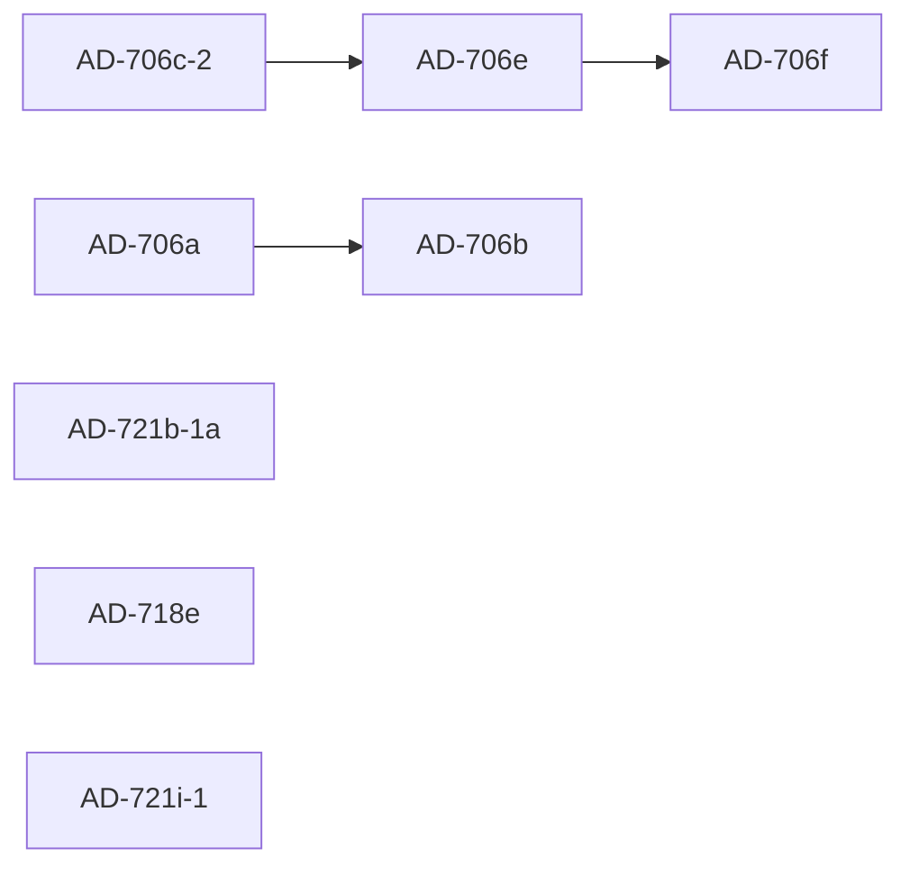

# Wave 166 — Browser Tool cluster + 3 independents

**Status:** Draft v1 (pending pass-1 review).
**Baseline:** 13762 pytest / 657 vitest (Wave 164 close).
**Estimated additions:** +70 pytest + +11 vitest across 8 ADs.
**New pip deps:** **1** (`cryptography>=42`, Apache 2.0 / BSD dual — AD-706f credential vault). **New npm deps: 0.**

---

## Roster

| Order | AD | Issue | Title | Tests |
|------:|----|-------|-------|------:|
| 1 | AD-706c-2 | #643 | Coordinate-aware `compute_use` tier for DOM-less surfaces | +14 pytest |
| 2 | AD-706e   | #520 | Browser Tool action vocabulary v2 (drag/key_combo/mouse/upload/download/eval_js) | +22 pytest |
| 3 | AD-706f   | #521 | Browser Tool credential vault integration | +14 pytest |
| 4 | AD-706a   | #516 | Captain-watch streaming bridge (MJPEG over HTTP) | +9 pytest +3 vitest |
| 5 | AD-706b   | #517 | Browser session video recording + retention policy | +9 pytest |
| 6 | AD-721b-1a| #663 | ffmpeg-backed audio format conversion | +8 pytest |
| 7 | AD-718e   | #526 | Multi-language voice selection | +8 pytest +5 vitest |
| 8 | AD-721i-1 | #542 | License-audited starter asset pack (manifest + audit, no asset bytes v1) | +6 pytest |

Total: **+70 pytest + +11 vitest**. Target close baseline: **≥13832 pytest / ≥668 vitest**.

## Build dependencies



Hard dependency: AD-706e references `_compute_use_consecutive_autonomous` from AD-706c-2 in its always-tier-3 set (low-risk integration; even if order swapped, no test fails). AD-706f's `upload_file.credential_ref` hook is forward-compatible — AD-706e ships the literal-path mode first; the vault hook lights up when AD-706f lands.

AD-706b references AD-706a's `require_crew_scope` query-param extension. Hard: AD-706a must land before AD-706b OR both ADs include the query-param extension and the second to land idempotently re-applies it.

Cluster 4-5 (streaming → recording) is independent of cluster 1-3 (compute_use → vocab → credentials). Builder can interleave or batch in dependency-safe order.

## Standing rules (embed in every commit)

- **BF-274**: single `replace_string_in_file` for adjacent edits (avoid `multi_replace_string_in_file` when blocks share context).
- **BF-280**: no `asyncio.create_subprocess_*` in runtime code paths — `subprocess.Popen` + `loop.run_in_executor`.
- **BF-282**: subprocess binary output via tempfile, never captured on stdout (Windows cp1252 corruption).
- **BF-286**: test scaffolding mirrors production subprocess shape (stubbed `subprocess.Popen` with assertable args).
- **BF-287**: real Pydantic config (`SystemConfig()`, `BrowserToolConfig()`, `AvatarsConfig()`) + real fixtures at substrate boundaries. No `MagicMock(spec=...)` at routers/auth, registry, intent_bus, attachment_store.
- **AD-722c-3**: every forward marker uses TECHNICAL trigger language (not calendar dates).
- **AD-731**: image/audio/video bytes through `AttachmentStore` SHA-256 refs, not inline base64. Applies to #2 recording (deferred to AD-706b-2 forward marker — recordings stay on disk in v1), #3 streaming JPEG frames (NOT stored; ephemeral), #6 audio (already covered by existing AttachmentStore flow).
- **AD-738b**: UI gate = `cd ui && npx vitest run` AND `cd ui && npm run build`. Both must pass for any UI-touching wave (#2 streaming panel, #3 recording panel, #7 lang filter).
- **AD-706d compat**: any new browser action verb added to `_HANDLERS` must also be classified by `classify_action` (rule) AND verified compatible with `classify_action_with_llm` (LLM companion). AD-706e Section 3 enforces this explicitly.
- **License whitelist**: CC0 / MIT / Apache-2.0 / BSD / CC-BY only. No GPL / AGPL / CC-BY-SA / CC-BY-NC. ffmpeg is operator-provided (LGPL acceptable at the boundary because gitignored).

## License posture summary

| AD | License decision |
|----|------------------|
| AD-706c-2 | No new deps. `cryptography` from AD-706f is in this wave but not in this AD. OmniParser explicitly excluded (AGPL — pattern-only, architecture-level inspiration). |
| AD-706e | No new deps. |
| AD-706f | **1 new pip dep: `cryptography>=42` (Apache 2.0 / BSD dual-licensed).** Fernet symmetric encryption for credential storage. KEK derived via stdlib `hashlib.scrypt` from `AuthConfig.crew_scope_token`. |
| AD-706a | No new deps. MJPEG via stdlib `multipart/x-mixed-replace`; Playwright `page.screenshot()` already present. |
| AD-706b | No new deps. Playwright `record_video_dir` is built-in. WebM is Playwright's native output codec. |
| AD-721b-1a | No new pip deps. **ffmpeg binary is operator-provided** at `tools/ffmpeg/ffmpeg(.exe)`, gitignored (LGPL-2.1+ / GPL-2+ stays at the operator boundary — same pattern as `tools/piper/piper(.exe)` and `tools/rhubarb/rhubarb(.exe)`). |
| AD-718e | No new deps. Catalog expansion downloads from `huggingface.co/rhasspy/piper-voices` (Apache 2.0 / MIT — verified clean per existing fetcher comment). |
| AD-721i-1 | No new deps. No asset bytes shipped. MANIFEST + audit + optional fetcher only. Captain ruling required to flip any candidate from RESEARCH to APPROVED. |

**Cumulative new pip deps for Wave 166: 1 (`cryptography>=42`).** New npm deps: 0.

> **Captain review required:** The user brief targeted "0 new pip/npm deps". AD-706f credential vault genuinely needs authenticated encryption — Python stdlib does not provide AES-GCM or Fernet. Alternatives considered: (a) DIY XOR+HMAC — security-fragile, NOT recommended for credentials; (b) `keyring` OS-keychain — adds Linux libsecret dep, defers cross-platform; (c) defer AD-706f to a later wave. Recommendation: **accept the `cryptography` dep** — it is Apache 2.0 / BSD dual-licensed (cleanest possible posture), is the de facto standard for Python crypto, and already transitively present via existing deps like `pyOpenSSL` and `urllib3[secure]` may pull it. Confirm via `pip show cryptography` before drafting the prompt as approved.

## Per-prompt workflow (Builder)

For each AD in build order:

1. Pre-flight: `git status` → tracked working tree clean (except `prompts/wave-plan.yaml` if architect modified). Pull baseline pytest count.
2. Read the prompt at `prompts/ad-<ad>-<slug>.md`.
3. Execute Section 0 (event types) → Section 1 (config) → Section 2..N (implementation) → Section tests.
4. Per-section gate: `pytest tests/test_<adNN>_*.py -v -n 0 --timeout=120`.
5. After all sections green serially: full gate `pytest tests/ -q -n 4 --dist=loadfile`.
6. If UI-touching: `cd ui && npx vitest run` AND `cd ui && npm run build`. Both must be green.
7. Commit with the standard multi-paragraph format. Update tracking files (`PROGRESS.md` Wave 166 section, `docs/development/roadmap.md` row, `DECISIONS.md` AD entry) in the same commit.
8. Re-run full gate before moving to next AD.

## Hard-stop conditions

Stop immediately and surface to user when:

- A working-tree file is modified that you didn't author (per `/memories/repo/probos-notes.md` working-tree integrity rule). Specifically: any tracked file with >200 line deletions on `git diff --numstat`.
- A test failure reproduces under serial (`-n 0`) AND is not order-dependent. Try `git stash` first to confirm whether your changes caused it.
- Pre-existing flakes in `test_callsign_routing.py` / `test_ad719_chat_fanout.py` or dreaming/ward_room — known, NOT a hard stop; document in build report.
- `pip install cryptography` fails on the runner (AD-706f only) — surface to user; do not retry indefinitely.
- A subprocess wrapper proposes `asyncio.create_subprocess_exec` — STOP and revise to `subprocess.Popen + executor` (BF-280 pattern).
- A new browser action verb is added to `_HANDLERS` but missing from `classify_action` — STOP and add (AD-706d compat).

## Wave-specific known false positives

- Tests under `xdist -n 4` may show one or two flakes per gate; rerun the failing file at `-n 0` to triage. If green serially → environmental noise; document and continue (per `/memories/probos-architect-learnings.md` xdist note).
- The `prompts/wave-plan.yaml` modification on `git status` at session start is architect-authored; commit on architect's behalf or leave alone.
- Builder using `multi_replace_string_in_file` for adjacent edits has caused BF-274 / BF-277 / BF-278 in the past — every prompt in this wave instructs single `replace_string_in_file` for adjacent edits. Enforce.
- Captain may run `tmp_capture_proxy` / `gh issue create` during the wave for unrelated diagnostic work; do not panic on transient `probos.pid` changes (per `/memories/probos-architect-learnings.md` "Builder broad python-kill" lesson — use `scripts/kill-stale-pytest.ps1` if pytest workers hang).

## Closing checklist (post-sweep)

1. All 8 AD commits pushed to `origin/main`.
2. All 8 GH issues closed via commit footer or `gh issue close`.
3. `PROGRESS.md` Wave 166 section reflects shipped state.
4. `docs/development/roadmap.md` Bug Tracker has no Wave 166 BF entries open.
5. `DECISIONS.md` highest AD: AD-739 → AD-739 still (Wave 166 sub-AD forward markers don't bump the highest; AD-740 is the next greenfield slot).
6. Update `/memories/session/wave-166-progress.md` with commits + test count deltas + any deviations.
7. License audit: re-verify `pip show cryptography` shows Apache 2.0 / BSD; document in DECISIONS AD-706f entry.

## File inventory (this wave)

```
prompts/ad-706c-2-coord-aware-compute-use.md
prompts/ad-706e-action-vocab-v2.md
prompts/ad-706f-credential-vault.md
prompts/ad-706a-captain-watch-streaming.md
prompts/ad-706b-session-video-recording.md
prompts/ad-721b-1a-ffmpeg-audio-conversion.md
prompts/ad-718e-multi-language-voice.md
prompts/ad-721i-1-starter-asset-pack-license-audit.md
prompts/WAVE-166-DISPATCH.md  (this file)
```
