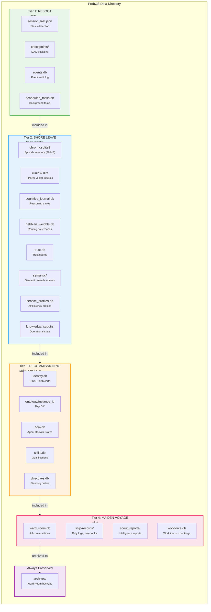

# BF-070: Tiered Reset System

## Problem

The `probos reset` command has accumulated file cleanups ad-hoc across 20+ ADs and BFs. Result:
- **11 databases/directories are silently missed** by reset (episodic memory, trust, ACM, skills, workforce, service profiles, directives, scheduled tasks, scout reports, semantic index)
- The ChromaDB cleanup was **a complete no-op** since day one (looking for `chroma/` subdirectory that doesn't exist; actual data is `chroma.sqlite3` in data root)
- No granular control beyond two modes: "reset" and "reset --wipe-records"
- Users cannot understand what is being cleared or preserved
- `--keep-trust` only applies to knowledge store subdirectory, not `trust.db`

## Solution: Tiered Reset Architecture

Four cumulative tiers. Each tier includes all tiers below it. The metaphor is naval: from rebooting the computer to decommissioning the ship.

### Tier Definitions

```
┌─────────────────────────────────────────────────────────────────┐
│ Tier 4: MAIDEN VOYAGE (--full)                                  │
│   Institutional knowledge — organizational memory lost          │
│   ┌─────────────────────────────────────────────────────────┐   │
│   │ Tier 3: RECOMMISSIONING (default)                       │   │
│   │   Agent identity & lifecycle — new ship, new crew       │   │
│   │   ┌─────────────────────────────────────────────────┐   │   │
│   │   │ Tier 2: SHORE LEAVE (--keep-identity)           │   │   │
│   │   │   Agent cognition — learned behavior wiped      │   │   │
│   │   │   ┌─────────────────────────────────────────┐   │   │   │
│   │   │   │ Tier 1: REBOOT (--soft)                 │   │   │   │
│   │   │   │   Runtime transients — safe, always     │   │   │   │
│   │   │   └─────────────────────────────────────────┘   │   │   │
│   │   └─────────────────────────────────────────────────┘   │   │
│   └─────────────────────────────────────────────────────────┘   │
└─────────────────────────────────────────────────────────────────┘
```

### Tier 1: REBOOT (`--soft`)
Clears runtime transients. Everything here is recreated on next boot. Zero behavioral impact.

| File | Purpose | Consequence of Reset |
|------|---------|---------------------|
| `session_last.json` | Stasis detection record | Next boot is "first boot" instead of "stasis recovery" |
| `checkpoints/` | DAG position tracking | Rebuilt automatically from task definitions |
| `events.db` | Event audit log | Lose historical event records (informational only) |
| `scheduled_tasks.db` | Background task persistence | Pending tasks re-register from config on boot |

### Tier 2: SHORE LEAVE (`--keep-identity`)
Clears agent cognition. Same crew, same ship, but agents forget all experiences. Useful for: "I broke trust/routing, reset learning but keep who everyone is."

Includes Tier 1, plus:

| File | Purpose | Consequence of Reset |
|------|---------|---------------------|
| `chroma.sqlite3` | Episodic memory (all agent memories) | Agents forget every experience. Dream consolidation, personality evolution, recall — all gone. |
| `<uuid>/` dirs | ChromaDB HNSW vector indexes | Internal to episodic memory. Must be cleaned with chroma.sqlite3. |
| `cognitive_journal.db` | Reasoning traces, introspective history | Agents lose self-reflective records |
| `hebbian_weights.db` | Routing preferences | System forgets which agents are good at what. Routing reverts to uniform. |
| `trust.db` | Trust network scores | All agents revert to trust priors. Reputation reset. |
| `semantic/` | Semantic knowledge ChromaDB indexes | Search indexes rebuilt from scratch on boot |
| `service_profiles.db` | External service latency/reliability | System forgets learned API behavior patterns |
| `knowledge/` subdirs | Trust snapshots, routing weight backups | Warm-boot restoration data gone (JSON/PY files) |

### Tier 3: RECOMMISSIONING (default `reset -y`)
New ship, new crew. Agents get new identities. The "fresh install" — current default behavior, now actually complete.

Includes Tiers 1+2, plus:

| File | Purpose | Consequence of Reset |
|------|---------|---------------------|
| `identity.db` | DIDs, birth certificates, Identity Ledger | All agents get new UUIDs, new DIDs, new birth certs on next boot |
| `ontology/instance_id` | Ship DID | This becomes a different ship entirely. New `did:probos:{id}` |
| `acm.db` | Agent lifecycle states, audit trail | All administrative history gone. Agents start as PROBATIONARY |
| `skills.db` | Skill qualifications, progression | Agents lose all earned certifications. Back to zero |
| `directives.db` | Runtime standing orders, Captain's directives | The evolving constitution is wiped. Only config-level orders survive |

### Tier 4: MAIDEN VOYAGE (`--full`)
Everything. Nuclear option. True blank slate. Use for sea trials or "start completely over."

Includes Tiers 1+2+3, plus:

| File | Purpose | Consequence of Reset |
|------|---------|---------------------|
| `ward_room.db` | All Ward Room conversations | Archived to `archives/` before deletion. All conversation history gone |
| `ship-records/` | Git-backed institutional knowledge (duty logs, notebooks, Captain's Log) | Organizational memory destroyed. **Not recoverable.** |
| `scout_reports/` | Scout intelligence reports | External scanning history lost |
| `workforce.db` | Work items, bookings, journals | All work history and scheduling state gone |

### Always Preserved
| File | Purpose | Why |
|------|---------|-----|
| `archives/` | Ward Room backups | Safety net. Manual cleanup only. |

## CLI Design

### Flags

```
probos reset -y                  # Tier 3: Recommissioning (default, backward compatible)
probos reset -y --soft           # Tier 1: Reboot (transients only)
probos reset -y --keep-identity  # Tier 2: Shore Leave (wipe cognition, keep identity)
probos reset -y --full           # Tier 4: Maiden Voyage (everything)
probos reset -y --dry-run        # Show what would be cleared, do nothing
```

### Backward Compatibility
- `--wipe-records` remains as alias for `--full` (deprecated, prints notice)
- `--keep-trust` removed (superseded by `--keep-identity` which preserves all of Tier 3)
- `--keep-wardroom` removed (superseded by tier system; ward_room only cleared at Tier 4)
- Default `reset -y` behavior is Tier 3 (same intent as current, but now actually complete)

### Confirmation Prompt

When run without `-y`, show the tier and exactly what will be cleared:

```
╭─ ProbOS Reset: Tier 3 — Recommissioning ─────────────────────╮
│                                                                │
│  This will clear:                                              │
│                                                                │
│  Tier 1 — Runtime Transients                                   │
│    • session_last.json          Session record                 │
│    • checkpoints/               DAG checkpoints (2 files)      │
│    • events.db                  Event log (32 KB)              │
│    • scheduled_tasks.db         Scheduled tasks (12 KB)        │
│                                                                │
│  Tier 2 — Agent Cognition                                      │
│    • chroma.sqlite3             Episodic memory (36.4 MB)      │
│    • cognitive_journal.db       Cognitive journal (28 KB)      │
│    • hebbian_weights.db         Hebbian weights (12 KB)        │
│    • trust.db                   Trust network (12 KB)          │
│    • semantic/                  Semantic indexes (1 dir)       │
│    • service_profiles.db        Service profiles (12 KB)       │
│    • knowledge/                 Knowledge store (3 subdirs)    │
│                                                                │
│  Tier 3 — Agent Identity                                       │
│    • identity.db                Identity registry (102 KB)     │
│    • ontology/instance_id       Ship DID                       │
│    • acm.db                     Agent Capital Mgmt (28 KB)     │
│    • skills.db                  Skill registry (45 KB)         │
│    • directives.db              Standing orders (12 KB)        │
│                                                                │
│  Preserved:                                                    │
│    • ward_room.db               Ward Room (73 KB)              │
│    • ship-records/              Ship's Records                 │
│    • scout_reports/             Scout reports                  │
│    • workforce.db               Workforce data (77 KB)         │
│    • archives/                  Ward Room backups              │
│                                                                │
│  ⚠  3 active scheduled task(s) will fire post-reset with      │
│     degraded routing.                                          │
│                                                                │
╰────────────────────────────────────────────────── Continue? [y/N]
```

### --dry-run Output

Same table as above but with `[DRY RUN] No changes made.` footer. Lets the user see exactly what would happen before committing.

### Summary Output (post-reset)

```
Reset complete — Tier 3: Recommissioning

  Tier 1 (Runtime):   4 items cleared
  Tier 2 (Cognition): 7 items cleared (36.5 MB freed)
  Tier 3 (Identity):  5 items cleared

  Preserved: ward_room.db, ship-records/, scout_reports/, workforce.db, archives/

  Ward Room archived to: .../archives/ward_room_2026-03-29_143000.db
  ⚠  3 scheduled task(s) active — routing may be degraded until Hebbian weights rebuild.
```

## Mermaid Diagram



## Implementation Notes

### Tier resolution logic
```python
# Determine effective tier from flags
if args.soft:
    tier = 1
elif args.keep_identity:
    tier = 2
elif args.full or getattr(args, 'wipe_records', False):
    tier = 4
else:
    tier = 3  # default: Recommissioning
```

### ChromaDB cleanup (fix the day-one bug)
The `EpisodicMemory` constructor receives `data_dir/episodic.db` as `db_path`. The `start()` method uses `Path(db_path).parent` (= `data_dir` itself) as the ChromaDB `PersistentClient` path. ChromaDB stores:
- `chroma.sqlite3` — main database, directly in data_dir
- UUID-named subdirectories — HNSW vector index segments

Cleanup must target `chroma.sqlite3` + any UUID-named directories (glob for directories matching UUID pattern).

### File inventory per tier
Define as data structure, not scattered if-statements:

```python
RESET_TIERS = {
    1: {
        "name": "Reboot",
        "flag": "--soft",
        "files": ["session_last.json", "scheduled_tasks.db", "events.db"],
        "dirs": ["checkpoints"],
    },
    2: {
        "name": "Shore Leave",
        "flag": "--keep-identity",
        "files": ["chroma.sqlite3", "cognitive_journal.db", "hebbian_weights.db",
                  "trust.db", "service_profiles.db"],
        "dirs": ["semantic"],
        "special": ["chromadb_uuid_dirs", "knowledge_subdirs"],
    },
    3: {
        "name": "Recommissioning",
        "flag": "(default)",
        "files": ["identity.db", "acm.db", "skills.db", "directives.db"],
        "special": ["ontology_instance_id"],
    },
    4: {
        "name": "Maiden Voyage",
        "flag": "--full",
        "files": ["ward_room.db", "workforce.db"],
        "dirs": ["ship-records", "scout_reports"],
        "archive_first": ["ward_room.db"],
    },
}
```

### Ward Room archiving
Ward Room archiving (copy to `archives/` before deletion) moves from ad-hoc to a declared behavior: `"archive_first"` key in the tier definition. Only happens at Tier 4.

### Confirmation prompt
Use Rich panel/table for the confirmation prompt. Show each tier being cleared with file sizes. Show what's preserved. Show warnings (active tasks, etc.).

### Git commit
The existing git commit logic (lines 674-700) should remain — it commits any knowledge store changes before the cleanup is finalized.

### Test updates
Existing reset tests will need updating to cover:
- `--soft` flag (Tier 1 only)
- `--keep-identity` flag (Tier 2)
- Default behavior (Tier 3 — now more thorough)
- `--full` flag (Tier 4)
- `--wipe-records` backward compat alias
- `--dry-run` (no files deleted)
- Confirmation prompt shows correct tier info

## Migration Notes

- `--wipe-records` becomes deprecated alias for `--full`. Print: `"⚠ --wipe-records is deprecated, use --full"`
- `--keep-trust` removed (superseded by tier system)
- `--keep-wardroom` removed (ward_room.db only cleared at Tier 4)
- Default `reset -y` semantics unchanged (Tier 3 = recommissioning intent) but now actually clears everything it was supposed to
- No changes to `runtime.py` lifecycle detection — it already handles the cases correctly once the files are properly cleaned

## Bug Fix Tracker

- **BF-070a**: ChromaDB cleanup was no-op (looking for `chroma/` dir, actual file is `chroma.sqlite3`) — FIXED in architect session
- **BF-070b**: `trust.db` not cleaned, causing "restart" misdetection instead of "first_boot" — FIXED in architect session
- **BF-070c**: 9 additional databases/directories never cleaned by reset — addressed by this tier system
- **BF-070d**: `--keep-trust` only applied to knowledge subdirectory, not `trust.db` — superseded by tier system
