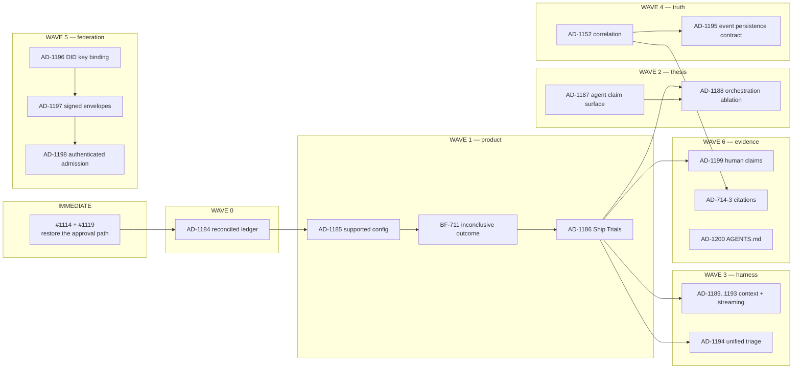

# ProbOS Build Plan — 2026-08-03

**Inputs reconciled:** the dormant-code audit (run 1 `audit-findings-2026-08-03-run1-opus.md`,
run 2 `audit-findings-2026-08-03-run2.md`) and the architecture current/future-state review held
in the private commercial overlay (`research/architecture-current-and-future-state-2026-08-03.md`,
six passes).

**Baseline:** OSS `main` @ `a81c0160`. Gate 22,529 passing.

**Numbering ceiling, established from three sources plus open issues:** highest AD assigned is
**AD-1183** (#1118), highest BF is **BF-710** (#1119). Both were assigned by the audit runs and
neither has code yet. **Next free: AD-1184 / BF-711.** Note the tree-scan alone would say
AD-1180 / BF-706 — the audit-assigned numbers exist only as issues, which is exactly the
reconciliation gap Wave 0 fixes.

---

## How this plan was built

The two inputs answer different questions and disagree in useful ways.

- The **audit** asks "can this run?" and "should this exist in this shape?" It produced four
  Part A defects and three Part B decisions, all now filed.
- The **architecture review** asks "is this the system we meant to build, and where is the field?"
  It produced twelve priorities and — deliberately — assigned no AD numbers, because the
  programs were not yet decomposed into single testable decisions and the trackers were
  unreconciled.

This plan does that decomposition. Where the architecture review names a program, it becomes an
epic with bounded ADs beneath it. Where it names a single change, it becomes one AD. Where an
owner already exists, the plan extends that owner rather than opening a parallel lane — that was
the sixth pass's central correction and it is preserved here.

**Three things the plan deliberately does NOT do:**

1. It does not assign numbers to work that is still a program. Epics carry the program; ADs carry
   testable decisions.
2. It does not re-file anything with an existing owner. AD-1152 (#1079), AD-1143 (#1064),
   AD-713-1, AD-714-3, AD-496, AD-854/855, AD-443f, AD-479l, AD-480j/k/m are all live
   allocations. They are referenced, not duplicated.
3. It does not touch `docs/development/open-ads-report.md`, whose own header marks it a stale
   2026-03-31 snapshot. Wave 0 generates its replacement.

---

## Already filed — no action needed here

| Issue | Source | Status |
|---|---|---|
| #1113 BF-707 | run 1 side-finding | gap-regex word boundary |
| #1114 BF-708 | run 1 detector 4 | capability-request notices 100% skipped |
| #1115 BF-709 | run 1 detector 4 | request title is the assembled prompt |
| #1119 BF-710 | run 1↔2 reconciliation | both approval panels never mounted |
| #1116 AD-1181 | run 2 detector 9 | agent-native vs CrewOrchestrator boundary |
| #1117 AD-1182 | run 2 detector 10 | Captain Card config has no reader |
| #1118 AD-1183 | run 2 detector 11 | falsified competitive claims in public OSS |

**#1114 + #1119 together are the highest-user-impact defect in either report** and should be
fixed first regardless of wave ordering: an agent asks for permission and there is currently no
path — push or pull — by which the Captain learns of it.

---

# WAVE 0 — Authority

Nothing else is reliable until the trackers agree. This is not administrative polish: the
ceiling for this very plan had to be derived from GitHub because the tree disagrees with the
issue list by three AD numbers and four BF numbers.

### AD-1184 — Generate a reconciled AD/BF lifecycle view from the live authorities

Replace the stale snapshot with a generated view over Git history, `DECISIONS.md`,
`PROGRESS.md`, and open issues. Each number gets exactly one state: allocated-open, deferred,
shipped, superseded, or retired. AD-1152 (#1079) is the worked example — it is intentionally
allocated unfinished work, and a tree scan alone reads it as a free number.

**Acceptance:** a generator, a CI check that fails on divergence, and a first run that reconciles
every AD/BF from 1100/700 upward. Must correctly classify the seven audit-assigned numbers above,
which exist as issues with no code.

---

# WAVE 1 — Define and regression-test the supported product

The architecture review's Priority 1, and its assessment of the top product risk: not missing
features, but no versioned statement of which configuration is the product, and no longitudinal
measure of whether it does representative work well.

Audit corroboration: **199 default-OFF flags, 80 armed on the reference vessel, 119 never
enabled.** The two reports independently reached the same conclusion from different directions.

### AD-1185 — A supported `SystemConfig` contract, parsed and booted in CI

One versioned supported configuration, distinct from the existing `minimal`/`developer`/`full`
**extension** profiles (which govern extension IDs, not `SystemConfig`) and from the ablation
control arm. Three named profiles: `minimal` (byte-identical control), `supported` (the product),
and explicit experimental treatments.

Explicitly **not** an "everything on" profile — mutually exclusive research and security modes
exist. Requires a flag dependency/conflict graph and a rule that every new gate declares its
intended profile and its evidence-to-promote.

### BF-711 — Judge and infrastructure failure must not score as competence failure

**This is a defect, not a design task, and it blocks Ship Trials.**
`communication_benchmarks._score_response` returns an all-zero `CommunicationScore` on three
paths — `llm_client is None` (`:114`), a raising scoring call (`:130-132`), and failed JSON
extraction (`:142`). `QualificationHarness` records `score=0.0, passed=False` on timeout and
exception (`:399-414`, `:502-517`).

Given the BF-654 / BF-659 / BF-665 / BF-674 endpoint-saturation history, a proxy outage during a
trial run is **arithmetically indistinguishable from a genuine competence collapse.** Gate a
release on that and the first production behaviour is a false red build during an incident.

AD-1143 already has the right semantics (`judge_failed → inconclusive`). Adopt them here rather
than inventing a second result model.

### AD-1186 — Ship Trials: a release catalog and policy over the existing evaluators

A **composition**, not a new harness. Composes AD-713 YAML behavior contracts,
`QualificationHarness`, communication benchmarks, Holodeck scenarios, memory probes,
grounded-refusal checks, and AD-1143's content-hashed blind-judge artifacts.

Hard prerequisites: AD-1185, BF-711, and **AD-713-1's hot-runtime invoker** — `probos qa
run-contracts` currently uses a stub returning empty strings, so the contracts do not execute
against a live runtime.

Start at 20–30 tasks. Statistical policy must be settled before any score blocks main; a single
noisy LLM-judge delta must not fail a build.

---

# WAVE 2 — The coordination thesis

The architecture review's Priority 2 and the audit's Part B #2 are the same finding reached
independently. #1116 (AD-1181) already owns **the decision**. These own **the evidence**.

### AD-1187 — A governed agent-facing claim and discovery surface over AD-496

AD-496 already implements atomic capability/trust-matched pull assignment
(`WorkItemStore.claim_work_item()` + `POST /api/work-items/claim`). It is reachable only through
a Captain/client REST route, exposes no peer-visible ready-work view, and explicitly excludes
`crew_session`.

This is the missing seam for any pull-board treatment — and independently useful. **Do not build
another queue or claim protocol.**

### AD-1188 — Orchestration-mode ablation rig

Two linked comparisons on the same goals and budget:

1. legacy `DAGExecutor` versus durable `CrewOrchestrator` — the value of durable
   planning/recovery/verification as a whole;
2. fixed CrewOrchestrator sequencing versus pull-board coordination **inside** the durable
   substrate, holding WorkItem persistence, recovery, assignment criteria, verifier, finalizer,
   artifacts and governance constant.

Measure completion quality, retries, cost, wall time, recovery, work concentration, cross-agent
information flow, and novel coordination. Reuses AD-1143's rig and `tests/ablation/`.

**Precondition worth stating:** the audit found **no crew session has ever executed** on the
reference vessel — 36 crew log lines, all startup wiring, zero work items created. Answer *why
crew has never run* before spending a wave measuring it.

---

# WAVE 3 — Harness and context parity

Architecture review Priority 5, decomposed. Each is independently measurable through Ship Trials.

| AD | Change |
|---|---|
| **AD-1189** | Deferred tool schemas in `swe_harness` — port AD-983d's manifest + lazy-retrieval pattern; do not duplicate its catalog |
| **AD-1190** | Delegation-tree aggregate budget — keep depth 0–3, add aggregate token/iteration/concurrency/child-count ceilings across one tree |
| **AD-1191** | Typed delegated evidence — bounded status, claims, source refs, artifacts, verification state instead of untyped final text |
| **AD-1192** | Durable plan writer for `WorkItem.steps` — owner-safe CAS contract; define who may create, submit, verify and close a step before wiring AD-1155's `open_todos` |
| **AD-1193** | Conversational streaming — `llm_client` hardcodes `"stream": False` at two transport sites. Stream only paths that can consume partial text safely; keep structured-output paths non-streaming |

**Explicitly not in this wave:** provider prompt caching. AD-1149 ran a live experiment against
the configured proxy and recorded *"DEFER. Do not build."* Its unblock conditions are precise —
an endpoint that honours a directive **and** reports cache creation/read usage. Neither holds.

**Already closed, do not re-plan:** AD-1149's "bigger prize" claim that `token_budget` could
never fire is false at HEAD. BF-680 shipped estimation (`agentic_loop.py:895-896`), budget stop
reachable at `:923`.

### AD-1194 — Unify capability triage through AD-854

Architecture review Priority 4. AD-854 already owns `grant → install → build` triage and AD-855
drives blocked WorkItems through it. The ordinary NL gap path is separate: AD-1049 surfaces ARD
candidates then proceeds directly to self-modification, bypassing triage.

Extend AD-854 with `discover` and `SkillForge` rungs and route every gap producer through one
policy. Preserve AD-1049's rule that discovery only surfaces a candidate — no silent adoption.

---

# WAVE 4 — Observability that tells the truth

### AD-1152 (#1079) — already allocated and open. Do not re-number.

Run/tool/token correlation: one run ID rooted at ingress, `tool_call.id` on start and completion
events, parent linkage through decomposition/agent-run/consensus/tool/artifact, measured-vs-
estimated token provenance retained at the durable boundary, and privacy classification.

AD-1145 already decided the exporter attaches to `runtime.add_event_listener` and is not OSS
correlation work. **Priority 3 ends at truthful correlation.**

### AD-1195 — An event persistence contract

Run 2's highest Part A finding, unfiled by that run. `EventType` and the hash-chained `EventLog`
are separate protocols, so most live event types cannot be inferred from `events.db`. A forensic
query can conclude a live capability never ran.

Run 1 hit this from the other side: detector 4's output was **62% noise** because 232 of 377
silent markers exist only on error branches. Both runs found the same underlying problem — the
observability substrate cannot answer "did this run?" — from opposite directions.

Decide which events are durably queryable and which are log-only, and make the distinction
explicit rather than incidental.

---

# WAVE 5 — Authenticated federation

Architecture review Priority 6. `config/node-1.yaml`, `config/node-2.yaml` and both launchers
already exist. **Do not build another deployment scaffold** — turn the existing cluster into a
repeatable real-socket security gate.

Preflight: audit the shipped A2A `0.2.0` adapter against current protocol. AD-480j (SSE),
AD-480k (OAuth) and AD-480m (push callbacks) already own the known gaps.

| AD | Change |
|---|---|
| **AD-1196** | Bind existing `did:probos` identifiers (AD-441) to Ed25519 keys (AD-843b primitives); define rotation, revocation, loss and compromise recovery |
| **AD-1197** | Sign canonical envelopes; reject altered source/target/topic/body; nonce/timestamp/replay-window policy that does not trust sender wall clocks for ordering |
| **AD-1198** | Authenticate A2A/relay/attachment requests at the transport boundary, and verify behaviour under partition, restart, stale key, duplicate message and malicious peer |

The phrase *"configured-peer admission is explicitly not cryptographic source authentication"*
appears verbatim in AD-1123, AD-730-4, AD-722b-5a and AD-731a-1d. This wave closes it.

Reconcile rather than supersede: AD-443f owns the cross-process mobility demo; AD-479l owns
ZeroMQ CURVE but is conditional because NATS is the production transport.

---

# WAVE 6 — Evidence and interoperability

| AD | Change |
|---|---|
| **AD-1199** | Typed human-claim lifecycle — extend Captain's Log, `RecordsStore.write_entry(extra_frontmatter=…)`, revisions and AD-444 confirm/contradict with source identity, confidence, scope, derivation, contradiction/appeal, consent and erasure. Preserve human epistemic character; do not pretend human and model assertions are identical |
| **AD-714-3** | Anchored citations — already reserved. Execute over `AnchorFrame`, source refs, records, PROV-O, tool traces and artifact identities; render as clickable HXI citations. Use a ProbOS citation schema, not a copied vendor syntax |
| **AD-1200** | Hierarchical `AGENTS.md` / `AGENTS.override.md` discovery for when ProbOS works inside external repositories, with explicit precedence and byte limits. Preserve `.github/copilot-instructions.md` as fallback |

**Not re-filed:** AD-596a–e already adopted the AgentSkills.io standard and validate the format.
Limit any skill work to upstream validator/version conformance.

---

# Deliberately NOT filed

Recording these so a later reader does not re-derive them.

| Finding | Source | Why not |
|---|---|---|
| Rich Workspace has no production opener | run 2 detector 7 | AD-1023 explicitly defers ingress — intentional |
| Browser module comment says 10 actions, runtime derives 16 | run 2 detector 12 | comment drift; runtime is correct via one tuple |
| 120 modules exceed 500 lines; five exceed 5,000 | run 2 detector 10 | real maintenance cost, not an SRP proof. `CognitiveSpine` and organ lifecycle already exist. Refactor opportunistically when a wave touches the area |
| Work/conversation/auth containers are numerous | run 2 detector 8 | **live facts did not disagree.** Forced consolidation would erase valid scope boundaries |
| Tests force NATS OFF / HF offline while production differs | run 2 detector 3 | CANDIDATE test-profile follow-up; folds into AD-1185's profile work |
| `HookBus.ask` has no consumer | known | legitimate extension point |
| AD-1179 as originally scoped | run 1 + #1111 | only one action-dispatch tool exists and it is already consolidated with five drift guards; **zero drift found elsewhere**. Rescoped proposal is on the issue. Hold until a real drift instance appears |
| Prompt caching | AD-1149 | live experiment says defer; conditions unmet |

---

# Sequencing

**Why this order.** Restore the approval path first — it is a live blackout and cheap. Reconcile
the ledger next, because every subsequent boundary depends on the numbering being trustworthy.
Then define the product and make its evaluators failure-honest, because the coordination thesis
is only measurable once there is a stable configuration and a trustworthy score. Correlation and
federation are independent tracks that can run in parallel once Wave 1 is underway.

**Commercial track (referenced, not planned here):** managed deployment, Postgres migration,
tenant isolation, backup/restore and quotas already have owners in the commercial roadmap and
start beside Wave 1. Only managed OTel export waits on AD-1152, and managed trial trending waits
on AD-1186.

---

# Issues created 2026-08-03

| Number | Issue | Title | Wave |
|---|---|---|---|
| AD-1184 | #1120 | Reconciled AD/BF lifecycle view from live authorities | 0 |
| AD-1185 | #1121 | Supported `SystemConfig` contract, parsed and booted in CI | 1 |
| BF-711 | #1122 | Judge/infrastructure failure scores as competence failure | 1 |
| AD-1186 | #1123 | Ship Trials — release catalog and policy over existing evaluators | 1 |
| AD-1187 | #1124 | Governed agent-facing claim and discovery surface over AD-496 | 2 |
| AD-1188 | #1125 | Orchestration-mode ablation rig | 2 |
| AD-1189 | #1126 | Deferred tool schemas in `swe_harness` | 3 |
| AD-1190 | #1127 | Delegation-tree aggregate budget | 3 |
| AD-1191 | #1128 | Typed delegated evidence | 3 |
| AD-1192 | #1129 | Durable plan writer for `WorkItem.steps` | 3 |
| AD-1193 | #1130 | Conversational streaming | 3 |
| AD-1194 | #1131 | Unify capability triage through AD-854 | 3 |
| AD-1195 | #1132 | Event persistence contract | 4 |
| AD-1196 | #1133 | Bind DIDs to Ed25519 keys; rotation and revocation | 5 |
| AD-1197 | #1134 | Signed canonical envelopes with replay protection | 5 |
| AD-1198 | #1135 | Authenticated transport admission + two-node gate | 5 |
| AD-1199 | #1136 | Typed human-claim lifecycle | 6 |
| AD-1200 | #1137 | Hierarchical `AGENTS.md` discovery | 6 |

Epics holding the programs:

| Epic | Issue | Wave |
|---|---|---|
| Define and regression-test the supported product | #1138 | 1 |
| Test the coordination thesis | #1139 | 2 |
| Authenticate the existing two-node cluster | #1140 | 5 |

**Ceiling after this plan: next free AD-1201 / BF-712.**

AD-714-3 and AD-1152 (#1079) are existing allocations, referenced and not re-created. AD-713-1 is
a live reservation that AD-1186 depends on.
